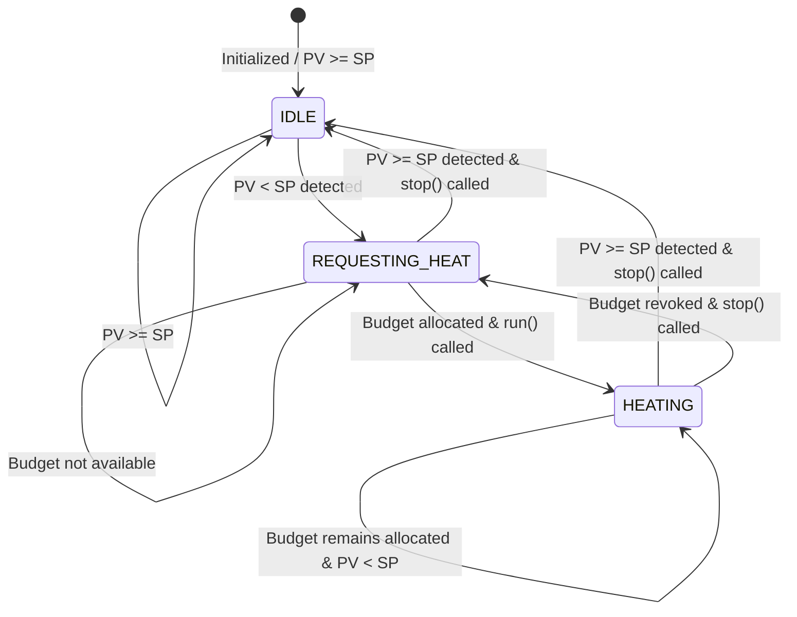
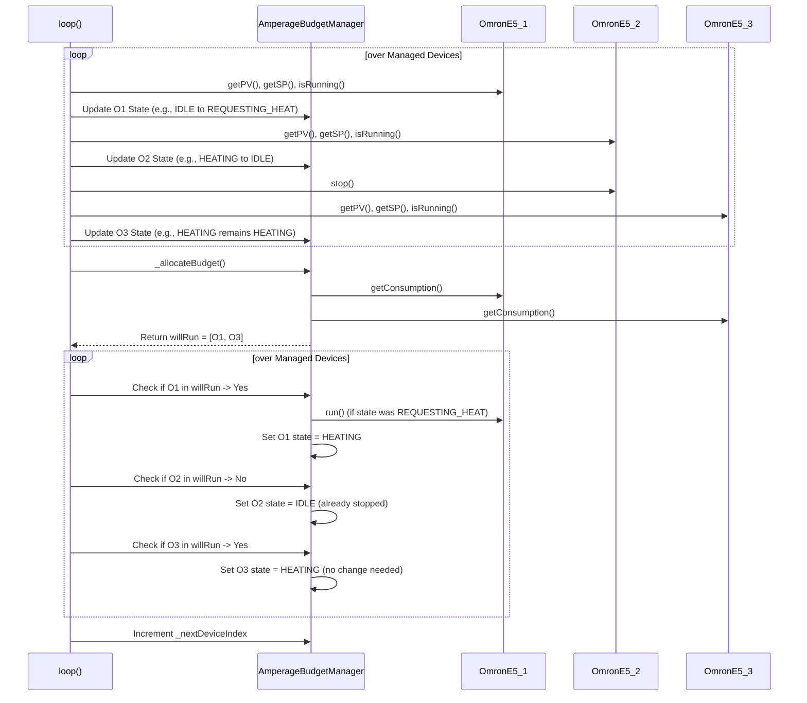

# Amperage Budget Manager Design

## 1. Introduction

This document outlines the design for the `AmperageBudgetManager` component. This component is responsible for managing a group of `OmronE5` temperature controllers (representing heating partitions) to ensure their total power consumption does not exceed a predefined budget. It achieves this by serializing the activation (`run()`) of the controllers based on heating demand (PV < SP) and available budget, using a fair scheduling algorithm.

## 2. Goals

*   Limit the instantaneous total power consumption of a group of `OmronE5` devices.
*   Provide a configurable power budget (in Watts).
*   Implement a fair scheduling mechanism (round-robin with preemption) to ensure all partitions needing heat get a chance to run over time.
*   Integrate seamlessly with the existing `PHApp` and `OmronE5` components.
*   Control `OmronE5` devices using their existing `run()` and `stop()` methods.

## 3. Component Architecture

### 3.1 Class Diagram

```mermaid
classDiagram
    Component <|-- AmperageBudgetManager
    AmperageBudgetManager o-- "0..*" ManagedDevice : contains
    ManagedDevice o-- OmronE5 : references
    PHApp o-- AmperageBudgetManager : owns
    PHApp o-- "*" OmronE5 : owns

    class Component {
        +setup() virtual
        +loop() virtual
        +info() virtual
    }

    class OmronE5 {
        +run() bool
        +stop() bool
        +getPV(uint16_t&) bool
        +getSP(uint16_t&) bool
        +isRunning() bool
        +getConsumption() uint32_t
        -_consumption : uint32_t
    }

    class ManagedDevice {
      +OmronE5* device
      +ManagedState state
      +uint8_t originalIndex
    }

    class AmperageBudgetManager {
        +AmperageBudgetManager(uint32_t wattBudget)
        +addManagedDevice(OmronE5* device)
        +setup() override
        +loop() override
        +info() override
        -uint32_t _wattBudget
        -ManagedDevice _managedDevices[]
        -uint8_t _numDevices
        -uint8_t _maxDevices
        -uint8_t _nextDeviceIndex
        -ManagedState state // Enum definition reference
        -_allocateBudget()
    }

    class PHApp {
        +setup()
        +loop()
    }

    enum ManagedState {
      UNKNOWN
      IDLE
      REQUESTING_HEAT
      HEATING
    }

    AmperageBudgetManager ..> ManagedState : uses
    ManagedDevice ..> ManagedState : uses
```

### 3.2 Data Structures

*   **`_wattBudget`**: `uint32_t` - The maximum combined wattage allowed for managed devices in the `HEATING` state.
*   **`_managedDevices`**: An array or similar structure holding pointers to the managed `OmronE5` instances along with their current state (`ManagedState`) and original registration order for stable sorting.
*   **`_nextDeviceIndex`**: `uint8_t` - Index used for the round-robin starting point.
*   **`ManagedState`**: Enum (`UNKNOWN`, `IDLE`, `REQUESTING_HEAT`, `HEATING`) - Tracks the state of each managed device from the budget manager's perspective.

### 3.3 Key Methods

*   **`AmperageBudgetManager(uint32_t wattBudget)`**: Constructor, sets the budget.
*   **`addManagedDevice(OmronE5* device)`**: Registers an `OmronE5` instance to be managed.
*   **`setup()`**: Initializes the manager, sets initial states.
*   **`loop()`**: The core logic, executed repeatedly. Checks device status, calculates needs, allocates budget, and sends `run()`/`stop()` commands.
*   **`info()`**: Prints debugging information about managed devices and budget status.
*   **`_allocateBudget()`**: Internal helper encapsulating the budget allocation logic described in section 4.

## 4. Scheduling Logic (Round-Robin with Preemption)

The `loop()` method executes the following logic periodically:

1.  **Identify Needs & Stop Unneeded:**
    *   Iterate through all `_managedDevices`.
    *   For each device, get its current PV, SP, and `isRunning()` status.
    *   If `PV >= SP` (wants to stop) and its state is `HEATING` or `REQUESTING_HEAT`:
        *   Call `device->stop()`.
        *   Set its state to `IDLE`.
    *   If `PV < SP` (wants to run):
        *   If its state is `IDLE`, change state to `REQUESTING_HEAT`.
    *   Keep track of devices currently in `HEATING` state and those in `REQUESTING_HEAT`.

2.  **Prioritize and Allocate Budget (`_allocateBudget`):**
    *   Create a list `potentialRunners` containing all devices currently in the `REQUESTING_HEAT` or `HEATING` state.
    *   Sort `potentialRunners` based on their original registration order, but starting the comparison cycle from `_nextDeviceIndex` to implement round-robin priority. (Effectively, devices closer to `_nextDeviceIndex` in the circular list get higher priority for this cycle).
    *   Initialize `currentWattage = 0`.
    *   Create an empty list `willRun`.
    *   Iterate through the prioritized `potentialRunners`:
        *   Get the device's consumption: `device->getConsumption()`.
        *   If `currentWattage + device->getConsumption() <= _wattBudget`:
            *   Add the device to the `willRun` list.
            *   `currentWattage += device->getConsumption()`.

3.  **Apply Changes:**
    *   Iterate through all `_managedDevices` again:
        *   If the device is in the `willRun` list:
            *   If its state was `REQUESTING_HEAT`, call `device->run()`.
            *   Set its state to `HEATING`.
        *   Else (device is *not* in `willRun` list):
            *   If its state was `HEATING`, call `device->stop()`.
            *   Set its state to `REQUESTING_HEAT` (if PV < SP) or `IDLE` (if PV >= SP - handled in step 1).

4.  **Update Robin Index:**
    *   Increment `_nextDeviceIndex` (wrapping around) to ensure the priority shifts in the next cycle: `_nextDeviceIndex = (_nextDeviceIndex + 1) % _numDevices`.

### 4.1 State Diagram (for a single managed OmronE5)



### 4.2 Sequence Diagram (Simplified `loop` cycle)



## 5. Configuration and Integration

*   **Instantiation:** An instance of `AmperageBudgetManager` should be created in `PHApp`.
    ```cpp
    // In PHApp.h (example)
    #include "components/AmperageBudgetManager.h"
    // ...
    AmperageBudgetManager* budgetManager;

    // In PHApp::setup() (example)
    _amperageBudget = new AmperageBudgetManager(10000); // Example: 10kW budget
    _amperageBudget->addManagedDevice(_omron1); // Assuming _omron1 is an OmronE5*
    _amperageBudget->addManagedDevice(_omron2);
    // ... add other Omrons
    _amperageBudget->setup();
    ```
*   **Budget Value:** The power budget (Watts) is passed to the constructor. This could be made configurable via Modbus or REST API by adding setter methods and potentially exposing them through `PHApp`.
*   **Device Consumption:** The manager relies on `OmronE5::getConsumption()`. This method needs to be added to the `OmronE5` class, returning the `_consumption` value (which might also need to be made configurable per `OmronE5` instance).
*   **PHApp Loop:** `AmperageBudgetManager::loop()` must be called from `PHApp::loop()`.
    ```cpp
    // In PHApp::loop()
    if (_amperageBudget) {
        _amperageBudget->loop();
    }
    ```

## 6. Potential Issues and Refinements

*   **SP Reachability:** If the budget is too low relative to the heat loss and the number/power of partitions, the system might struggle or fail to reach the Set Point (SP) on all devices. This requires careful tuning of the budget.
*   **Rapid Cycling:** If the budget forces frequent starting/stopping, it might cause wear on relays (if used by the Omron output). Hysteresis could be added (e.g., require PV to be `SP + delta` before stopping, or `SP - delta` before wanting heat).
*   **Consumption Accuracy:** The accuracy depends on the configured `_consumption` value in each `OmronE5`. If actual consumption varies significantly, the budget management might be inaccurate.
*   **Error Handling:** The design assumes `OmronE5` methods succeed. Robust error handling (checking return values of `run()`, `stop()`, `getPV`, etc.) should be added.
*   **Dynamic Budget:** The budget could be adjusted dynamically based on external factors (e.g., total system load).
*   **Advanced Scheduling:** More complex scheduling (e.g., prioritizing devices further from SP) could be implemented if simple round-robin proves insufficient.

## 7. Mathematical Modeling and Optimization Considerations

This section explores the mathematical underpinnings and potential optimizations for the budget management system.

### 7.1 Core Budget Constraint

Let N be the number of managed `OmronE5` devices. Let P_i be the power consumption (Watts) of device i when heating, obtained via `device[i]->getConsumption()`. Let S_i(t) be the state of device i at time t, where S_i(t) = 1 if the device is actively heating (state `HEATING`) and S_i(t) = 0 otherwise (`IDLE`, `REQUESTING_HEAT`, or stopped by the manager).

The fundamental constraint enforced by the `AmperageBudgetManager` at any given time t is:

```
Sum(S_i(t) * P_i for i=1 to N) <= W_budget
```

where W_budget is the configured maximum power budget.

The scheduling algorithm (Section 4, Step 2) effectively selects the subset of devices H(t) = { i | S_i(t) = 1 } such that this inequality holds, prioritizing devices based on need (PV_i < SP_i) and the round-robin index.

### 7.2 Error Sources

Potential sources of error can affect the system's ability to precisely meet the budget or achieve optimal heating:

1.  **Consumption Estimation Error (epsilon_P):** The actual power P_i_actual drawn by a heater might differ from the configured P_i. The total actual power is `Sum(P_i_actual for i in H(t))`. The budget calculation error is `Sum(P_i - P_i_actual for i in H(t))`. 
    *   *Mitigation:* Calibration, using more accurate power measurement if available, adding a safety margin to W_budget.
2.  **Measurement Delay (tau_m):** Time lag between a temperature change, its measurement by the `OmronE5` (PV update), and the `AmperageBudgetManager` reading it.
3.  **Control Delay (tau_c):** Time lag between the manager deciding to change a device's state (`run()`/`stop()`) and the command being executed and having an effect (e.g., RS485 communication delay, relay actuation time).
4.  **Sampling Rate:** The `loop()` frequency of the `AmperageBudgetManager` determines how quickly changes are detected and acted upon. A slower rate increases the effective delay.

### 7.3 Thermal Inertia and Dynamics

Each heating partition i has thermal characteristics. A simplified model might be a first-order system:

```
C_i * d(PV_i)/dt = Q_heat_i(t) - Q_loss_i(t)
```

where:
*   C_i is the thermal capacitance of partition i.
*   PV_i is the process variable (temperature) of partition i.
*   Q_heat_i(t) is the heat input rate. Q_heat_i(t) = P_i if S_i(t) = 1, and 0 otherwise (assuming idealized heater).
*   Q_loss_i(t) is the heat loss rate, often modeled as `U_i * (PV_i(t) - T_ambient)`, where U_i is a heat transfer coefficient and T_ambient is the ambient temperature.

**Implications:**

*   **Lag:** Due to C_i, the temperature PV_i changes gradually in response to Q_heat_i(t). Stopping heat doesn't instantly stop the temperature rise, potentially leading to overshoot, especially if the Omron's internal PID isn't tuned for intermittent operation.
*   **Interdependence:** Heat loss Q_loss_i(t) might depend not only on T_ambient but also on the temperatures of adjacent partitions (PV_j), creating thermal coupling.
*   **SP Reachability:** If the average heat input allowed by the budget over time (Avg_Q_heat_i) is less than the heat loss at the setpoint (Q_loss_i(SP_i)), the partition may never reach SP_i.
    ```
    Avg_Q_heat_i = P_i * (Average Duty Cycle for i) < Q_loss_i(SP_i)
    ```
*   **Minimum Effective On-Time (tau_min_on_i):** Due to thermal capacitance (C_i) and initial heat loss rate (Q_loss_i(t)), there might be a minimum duration tau_min_on_i for which a heater i must be active (S_i(t) = 1) to produce a significant or useful increase in PV_i. Activating a heater for durations less than tau_min_on_i could be inefficient, consuming power without meaningfully contributing to reaching the setpoint. The scheduling algorithm should ideally ensure that when a device is granted budget, it runs for at least this duration, or consider this constraint when deciding which devices to activate.

### 7.4 Optimization Objectives

Beyond simply staying within budget, optimization could target:

1.  **Minimize Time-to-Setpoint:** Reduce the total time for all devices requesting heat to reach their respective SP_i.
2.  **Maximize Fairness:** Ensure all devices requesting heat receive a proportional amount of heating time over a longer window, preventing starvation.
3.  **Minimize Overshoot:** Reduce the amount PV_i exceeds SP_i after heating stops.
4.  **Minimize Control Effort:** Reduce the frequency of `run()`/`stop()` commands to minimize wear on physical components (like relays).
5.  **Maximize Weighted Priority:** Allow certain devices to have higher priority in budget allocation.

### 7.5 Potential Control Improvements

1.  **Hysteresis:** Introduce a deadband around SP. Only request heat if `PV_i < SP_i - delta_lower` and only stop requesting heat if `PV_i > SP_i + delta_upper`. This reduces rapid cycling near the setpoint.
2.  **Priority Scheduling:** Instead of pure round-robin, prioritize devices based on:
    *   Error magnitude: `SP_i - PV_i`
    *   Time since last heated
    *   Configured static priority
3.  **Predictive Control:** Model the thermal dynamics (C_i, U_i) and predict future PV_i to make more informed decisions about when to start/stop heating, potentially anticipating overshoot or allocating budget more effectively.
4.  **Duty Cycle Modulation:** If the heating elements support it (unlikely with simple `run`/`stop`), modulate the *power* P_i rather than just on/off state, allowing finer budget control.
5.  **Adaptive Budget:** Adjust W_budget based on overall system state or external inputs.

## 8. Required Changes to OmronE5

*   Add a public method `uint32_t getConsumption() const;` to `OmronE5.h`.
*   Implement `OmronE5::getConsumption()` in `OmronE5.cpp` to return the value of the `_consumption` member variable.

```cpp
// In OmronE5.h
public:
    // ... other methods ...
    uint32_t getConsumption() const; // Add this

// In OmronE5.cpp
uint32_t OmronE5::getConsumption() const {
    return _consumption; // Assuming _consumption holds Watts
}
``` 