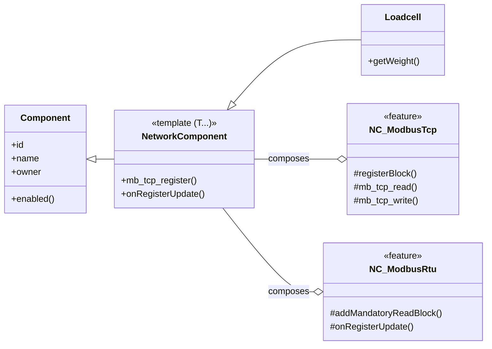

# Component Inheritance and Casting Strategy

## 1. The Problem

The `Loadcell` component requires functionality from both `RTU_Base` (for RS485 communication) and `NetworkComponent` (for Modbus TCP exposure). Both of these base classes inherit from `Component`.

This creates a "diamond inheritance" pattern:

```
      Component
      /       \
RTU_Base   NetworkComponent
      \       /
       Loadcell
```

This leads to two critical issues in C++:

1.  **Ambiguous Base Class:** Any code trying to access members of `Component` through a `Loadcell` pointer (e.g., `loadcell->id`) is ambiguous. Does it access `RTU_Base::Component` or `NetworkComponent::Component`?
2.  **Casting Failures:** The standard solution to ambiguity is `virtual` inheritance. However, if `Component` is a virtual base, downcasting from a `Component*` to a derived class pointer (e.g., `OmronE5*`) using `static_cast` becomes illegal. Since the project does not use RTTI, `dynamic_cast` is not available as an alternative.

This document outlines the viable and non-viable options to resolve this.

## 2. Option A: Virtual Inheritance (Non-Viable)

This is the classic C++ solution for the diamond problem.

-   **Concept:** Have `RTU_Base` and `NetworkComponent` inherit `virtual public Component`. This ensures that `Loadcell` receives only one shared instance of the `Component` base class, resolving the ambiguity.
-   **Why it Fails:** This approach makes it impossible to safely downcast. Code elsewhere in the project iterates through a list of `Component*` and casts them to specific types like `OmronE5*`.
    ```cpp
    // This becomes illegal if Component is a virtual base
    OmronE5* omron = static_cast<OmronE5*>(component_ptr);
    ```
    The C++ standard forbids `static_cast` for downcasting from a virtual base because the memory layout is not known at compile time. The only standard-compliant tool for this is `dynamic_cast`, which requires RTTI.

-   **Conclusion:** Due to the hard requirement of downcasting `Component` pointers without RTTI, this option is not feasible.

## 3. Option B: Composition over Inheritance (Recommended)

This option redesigns the relationship to avoid multiple inheritance of `Component`.

-   **Concept:** Instead of `Loadcell` "being a" `NetworkComponent`, it will "have a" network helper. We will refactor `NetworkComponent` into a helper class that does *not* inherit from `Component`. `Loadcell` will continue to inherit from `RTU_Base` (and thus `Component`), but will contain the new network helper as a member variable.

-   **Implementation Steps:**
    1.  Create a new template class, `NetworkHelper<N>`, from the code in `NetworkComponent`.
    2.  `NetworkHelper` will **not** inherit from `Component`.
    3.  The constructor for `NetworkHelper` will take a `Component* owner` to get access to `id`, `name`, `slaveId`, etc.
    4.  Modify `Loadcell` to have a member variable: `NetworkHelper<6> _netHelper;`.
    5.  The `Loadcell` constructor will initialize `_netHelper`, passing `this` as the owner.
    6.  `Loadcell` will implement network-related virtual functions (like `mb_tcp_blocks`) by forwarding the calls to its `_netHelper` member.
    7.  The `INIT_NETWORK_VALUE` macro must be updated to work with this new structure, or a new macro must be created.

-   **Pros:**
    *   **Solves the Problem:** Completely avoids the diamond inheritance and eliminates all ambiguity and casting issues.
    *   **Clear Relationship:** Arguably, a component "having" network capabilities is a clearer design than it "being" a network interface.
    *   **Safe:** No unsafe casting or compiler-specific tricks are needed.

-   **Cons:**
    *   **Refactoring Effort:** `NetworkComponent` must be refactored. Any other components that currently inherit from it (like `NetworkValueTest`) will also need to be updated to use the new `NetworkHelper` via composition.
    *   **Boilerplate Code:** Components like `Loadcell` will need to explicitly forward calls to their helper member, adding a small amount of boilerplate code.

## 4. Option C: Component-centric Feature System

This is a more advanced alternative that moves the "feature" concept from `NetworkValue` directly into the `Component` base class.

-   **Concept:** Instead of creating helper classes or using multiple inheritance, the `Component` class itself would be designed to be composed of optional features. Any component could be configured to include capabilities like `Modbus`, `ValueNotify`, etc.

-   **Implementation Sketch:**
    1.  **Generalize Feature Classes:** The `NV_Modbus`, `NV_Logging`, and `NV_Notify` classes would be refactored into generic, standalone "Feature" classes that do not inherit from `Component`.
    2.  **Adapt `Component`:** The `Component` class would be modified to aggregate these features. This could be done in two ways:
        *   **Compile-Time (Templates):** `Component` could become a variadic template class that inherits from the features it's given. This is powerful but creates a cascade of templates through all inheriting classes (`RTU_Base`, `Loadcell`, etc.), significantly increasing complexity.
            ```cpp
            template<typename... Features>
            class Component : public Features... { /* ... */ };

            // Usage would be complex:
            class Loadcell : public RTU_Base<Feature_Modbus, ...> {};
            ```
        *   **Runtime (Composition):** `Component` could hold pointers to optional feature objects, allocated on the heap. This avoids the template complexity but introduces dynamic memory management.
            ```cpp
            class Component {
                std::vector<IFeature*> _features;
            public:
                template<typename F, typename... Args>
                void addFeature(Args&&... args) {
                    _features.push_back(new F(std::forward<Args>(args)...));
                }
            };
            ```
    3.  **Update `Loadcell`:** `Loadcell` would inherit from `RTU_Base` as usual. In its constructor, it would call `this->addFeature<Feature_Modbus>(...)` and `this->addFeature<Feature_ValueNotify<uint32_t>>(...)` to gain the required functionality.

-   **Pros:**
    *   **Ultimate Flexibility:** Provides a unified way to add any capability to any component.
    *   **Clean Hierarchy:** Completely avoids all inheritance problems. `Loadcell` has a clear, single inheritance path from `Component` via `RTU_Base`.
    *   **No Boilerplate Forwarding:** The `Component` base class could manage calling `loop()` or `setup()` on all its registered features automatically.

-   **Cons:**
    *   **Highest Refactoring Effort:** This is a fundamental change to the core `Component` class and would require updating every component in the system.
    *   **Architectural Complexity:** Designing a robust and easy-to-use feature system is a significant undertaking. The choice between compile-time templates and runtime pointers has major implications for code complexity and memory usage.

## 5. Option D: Targeted Static Casting (Minimalist Fix)

This option resolves the ambiguity only at the specific lines of code where the compiler errors occur, without changing any class definitions.

-   **Concept:** Use `static_cast` to explicitly tell the compiler which inheritance path to take when converting a `Loadcell*` to a `Component*` or when accessing a member of `Component`. We can choose either `RTU_Base` or `NetworkComponent` as the intermediate path. Since `RTU_Base` is the primary functional parent, it's the more logical choice.

-   **Implementation Steps:**
    1.  **Fixing `components.push_back(loadCell_0)`:** In `src/PHApp.cpp`, cast the `loadCell_0` pointer to an `RTU_Base*` before adding it to the vector. This resolves the ambiguity of which `Component` base to use.
        ```cpp
        // src/PHApp.cpp
        components.push_back(static_cast<RTU_Base*>(phApp->loadCell_0));
        ```
    2.  **Fixing `loadCell_0->owner = rs485`:** In `src/RS485Devices.cpp`, cast the pointer to `RTU_Base*` before accessing the `owner` member.
        ```cpp
        // src/RS485Devices.cpp
        static_cast<RTU_Base*>(phApp->loadCell_0)->owner = rs485;
        ```

-   **Pros:**
    *   **Minimal Change:** Requires modifying only the two lines of code that produce compiler errors. It is by far the least invasive solution.
    *   **No Class Refactoring:** Avoids any changes to `Component`, `RTU_Base`, `NetworkComponent`, or `Loadcell`.
    *   **No Performance Overhead:** `static_cast` is a compile-time operation with zero runtime cost.

-   **Cons:**
    *   **Brittle & Localized:** This is a tactical patch, not a strategic architectural solution. It fixes these two errors but doesn't solve the underlying diamond inheritance problem. If `Loadcell` is used in any other ambiguous context in the future, that new code will also fail to compile and will require a similar explicit cast.
    *   **Technical Debt:** This approach knowingly papers over a design flaw. It can make the code harder to reason about for future developers who will have to understand why this specific component needs special casting.

## 6. Option E: Virtual Inheritance + Manual RTTI (LLVM-style `dyn_cast`)

This option revisits virtual inheritance (Option A) and solves its downcasting problem by implementing a manual, type-safe casting function.

-   **Concept:** The `Component` base class already has a `type` member that serves as a manual run-time type identifier. We can use this to create a `dyn_cast` function that checks this type before performing a safe `static_cast`. This avoids the need for the compiler's RTTI and `dynamic_cast`.

-   **Implementation Steps:**
    1.  **Enable Virtual Inheritance:** First, implement Option A. `RTU_Base` and `NetworkComponent` must inherit `virtual public Component`. This solves the diamond inheritance ambiguity.
    2.  **Ensure Type ID is Set:** Every class that inherits from `Component` must set its `type` member correctly in its constructor (e.g., `type = COMPONENT_TYPE::COMPONENT_TYPE_LOADCELL;`).
    3.  **Implement `dyn_cast`:** Create a `dyn_cast` template function that checks the component's type before casting.

        ```cpp
        // in a new component_cast.h
        template<typename To, typename From>
        To* dyn_cast(From* src) {
            using T = std::remove_pointer_t<To>;
            if (!src) return nullptr;
            if (src->type == T::COMPONENT_TYPE_ENUM) {
                return static_cast<To*>(src);
            }
            return nullptr;
        }

        // Note: This requires each castable class (e.g., OmronE5)
        // to expose its type enum, for example:
        // class OmronE5 : public RTU_Base {
        // public:
        //   static const COMPONENT_TYPE COMPONENT_TYPE_ENUM = COMPONENT_TYPE::COMPONENT_TYPE_PID;
        //   OmronE5() { type = COMPONENT_TYPE_ENUM; }
        //   ...
        // };
        ```
    4.  **Replace Casts:** Replace the `static_cast` calls that were failing in `src/PHApp.cpp` with the new `dyn_cast`.
        ```cpp
        // src/PHApp.cpp
        if (auto* omron = dyn_cast<OmronE5>(comp)) {
            omron->setConsumption(...);
        }
        ```

-   **Pros:**
    *   **"Correct" Inheritance:** Allows for a true "is-a" relationship using standard C++ virtual inheritance, which correctly models the single `Component` base.
    *   **Type Safe:** The `dyn_cast` check prevents incorrect casts at runtime.
    *   **Centralized Logic:** The casting logic is contained within the `dyn_cast` function, not scattered across the application.

-   **Cons:**
    *   **Requires Discipline:** Developers must remember to set the `type` and `COMPONENT_TYPE_ENUM` for every new component.
    *   **Two-Step Refactor:** Requires implementing virtual inheritance *first* and *then* fixing the resulting casting issues. This is more involved than the targeted patch of Option D.
    *   **`slaveId` Ambiguity:** The `slaveId` member exists in both `Component` and `RTU_Base`. Virtual inheritance will not solve this ambiguity; it must be resolved manually (e.g., by removing it from one of the classes or renaming it).

## 7. Recommendation

**Option B (Composition over Inheritance) remains the most robust long-term solution.** It correctly models the relationships between the classes ("has-a" vs "is-a") and eliminates the root cause of all ambiguity problems without manual workarounds.

However, if maintaining the "is-a" relationship with multiple inheritance is a design goal, then **Option E (Virtual Inheritance + `dyn_cast`) is the most architecturally sound way to achieve it.** It is superior to the simple `static_cast` patches of Option D because it correctly solves the underlying single-base-instance problem first, and then provides a safe way to handle the consequences.

**Updated Recommendation:**
-   For a quick, low-impact fix that accepts some technical debt: **Choose Option D.**
-   For the most robust, unambiguous, and maintainable architecture: **Choose Option B.**
-   For a "correct" multiple inheritance architecture: **Choose Option E.** It is a valid but more involved alternative to Option B. 

## 8. Option G: Refactoring RTU_Base into a Feature Mixin

This section outlines the strategy for refactoring `RTU_Base` into a `NC_Rtu` feature mixin for `NetworkComponent`. This will create a unified base class for all Modbus components, solving the diamond inheritance problem. The documentation will cover the concept, implementation details, a refactoring example using `OmronE5`, and a thorough analysis of the pros and cons of this advanced architectural approach.

### 8.1. Concept: A Single, Powerful Base Class

The core idea is to treat "being a Modbus RTU client" not as a base class to inherit from, but as a *capability* or *feature* that a `NetworkComponent` can possess. This elevates `NetworkComponent` to be the single, unified base for any component that needs to communicate over Modbus, whether it's acting as a TCP server endpoint, an RTU client, or both.

### 8.2. How It Would Work: The `NC_Rtu` Feature

We would introduce a new feature class, analogous to `NV_Logging` or `NV_Modbus` from `NetworkValue`, but for `NetworkComponent` itself.

1.  **Create `NC_Rtu`:** A new feature class, `NC_Rtu`, would be created. This class would **not** inherit from `Component`. It would contain the logic currently found in `RTU_Base`, such as:
    *   The `addMandatoryReadBlock()` method.
    *   The logic to queue write operations with the global `ModbusRTU` manager.
    *   State tracking for RTU communication (timeouts, errors, etc.).

2.  **Enhance `NetworkComponent`:** `NetworkComponent` would be modified to optionally inherit from `NC_Rtu` based on a template parameter or feature flag.
    *   It would gain the `onRegisterUpdate(uint16_t address, uint16_t newValue)` virtual function, which would be called by the `NC_Rtu` feature when new data arrives from the bus.
    *   The `NetworkComponent` would manage a pointer to the global `ModbusRTU` instance, passing it to the `NC_Rtu` feature upon initialization.

### 8.3. Blueprint: Refactoring `OmronE5`

The `OmronE5` component provides a clear "after" picture for this architecture.

**Current (Problematic) Structure:**
```cpp
// Inherits from RTU_Base, which creates a diamond with NetworkComponent
class OmronE5 : public RTU_Base { /* ... */ };
```

**Proposed Unified Structure:**
```cpp
// A template parameter could enable the RTU feature
template <size_t N, bool HasRtu = false>
class NetworkComponent : public Component, public maybe<HasRtu, NC_Rtu> 
{ /* ... */ };

// OmronE5 inherits from ONE base class and declares its needs
class OmronE5 : public NetworkComponent<OMRON_TCP_BLOCK_COUNT, /* HasRtu = */ true> 
{
public:
    OmronE5(Component* owner, uint8_t slaveId, ...) 
        : NetworkComponent(owner, ...)
    {
        // Initialize the RTU feature with its slaveId
        this->initRtuFeature(slaveId); 
    }

    short setup() override {
        // TCP setup is handled by NetworkComponent's base setup
        NetworkComponent::setup(); 

        // Add RTU read blocks. This method now comes from the NC_Rtu mixin.
        this->addMandatoryReadBlock(0x0000, 6, FN_READ_HOLD_REGISTER);
        
        // ... other setup ...
        return E_OK;
    }

    // This gets called by the NC_Rtu feature when data arrives from the bus
    void onRegisterUpdate(uint16_t address, uint16_t newValue) override {
        // Handle RTU register updates here...
    }

    // TCP methods remain unchanged
    short mb_tcp_read(MB_Registers* reg) override { /* ... */ }
    short mb_tcp_write(MB_Registers* reg, short value) override { /* ... */ }
    uint16_t mb_tcp_base_address() const override { /* ... */ }
};
```

### 8.4. Analysis of the Unified Approach

This model represents a highly integrated and powerful design.

**Pros:**

*   **Solves Diamond Inheritance:** It completely eliminates the diamond inheritance problem by establishing a single, clear inheritance path for all networked components.
*   **Reduces Boilerplate:** Components like `OmronE5` and `Loadcell` become much simpler. They no longer need to manually implement forwarding to a helper class; they simply inherit the required functionality from their single `NetworkComponent` base.
*   **True "Is-A" Relationship:** A component truly "is a" `NetworkComponent`, with all the capabilities that entails, rather than having to delegate to helper objects.

**Cons:**

*   **"God Class" Risk:** This approach concentrates a significant amount of responsibility into `NetworkComponent`, making it a large and complex class that handles both TCP server logic and RTU client logic. This can make the base class harder to understand and maintain.
*   **High Refactoring Cost:** This is the most invasive refactoring option. It requires fundamentally redesigning `NetworkComponent` and `RTU_Base`, and would necessitate updating every single component that currently uses either of them.
*   **Blurred Responsibilities:** It merges the very different concerns of being a passive TCP endpoint and an active RTU client into a single class, which can be seen as a violation of the Single Responsibility Principle.

### 8.5. Conclusion on Option F

Option F is an architecturally elegant but pragmatically challenging solution. It offers the cleanest public API for components like `OmronE5` and `Loadcell`, but at the cost of creating a highly complex base class and requiring a system-wide refactoring effort. It should be considered a long-term architectural goal, to be approached with caution after the more immediate problems are solved using the less invasive compositional approach (Option B). 

## 9. Final Architecture: A Unified `NetworkComponent` with Composable Features

This section details the definitive architectural solution that resolves the diamond inheritance problem by refactoring `NetworkComponent` into a versatile, feature-based class. This approach draws inspiration from the design of `NetworkValue`, using template-based composition to mix in required capabilities like Modbus TCP and RTU, rather than relying on multiple inheritance or helper objects.

### 9.1. Core Concept: From Inheritance to Feature Composition

The fundamental shift is to stop treating network protocols as base classes to inherit from. Instead, they become **features** that are composed at compile time into a single, lean `NetworkComponent` base.

1.  **A Lean `NetworkComponent` Base:** The `NetworkComponent` class will be refactored into a variadic template class. It will inherit from `Component` and also from any feature classes passed to it as template arguments.
2.  **Standalone Feature Classes (`NC_ModbusTcp`, `NC_ModbusRtu`):**
    *   The logic from the current `NetworkComponent` will be extracted into a feature class named `NC_ModbusTcp`.
    *   The logic from `RTU_Base` will be extracted into a feature class named `NC_ModbusRtu`.
    *   Crucially, these feature classes will **not** inherit from `Component`. They are pure feature mixins. They will be given an owner pointer to the `NetworkComponent` instance to access shared data (`id`, `name`, etc.).

### 9.2. Architecture Diagram

This diagram illustrates the final proposed architecture. `NetworkComponent` acts as an aggregator, composing the TCP and RTU features. `Loadcell` then inherits this aggregated functionality.



### 9.3. Blueprint: Refactoring `Loadcell`

This code demonstrates how `Loadcell` would be implemented under the new architecture.

1.  **Refactored `NetworkComponent` Header (Conceptual):**
    ```cpp
    // In a new file, e.g., features/NC_ModbusTcp.h
    class NC_ModbusTcp { /* ... TCP logic ... */ };

    // In a new file, e.g., features/NC_ModbusRtu.h
    class NC_ModbusRtu { /* ... RTU logic ... */ };

    // The new NetworkComponent.h
    #include "features/NC_ModbusTcp.h"
    #include "features/NC_ModbusRtu.h"

    template <typename... Features>
    class NetworkComponent : public Component, public Features... {
    public:
        NetworkComponent(Component* owner, ...) : Component(owner, ...) {
            // Pass 'this' pointer to each feature
            (Features::initFeature(this), ...);
        }
        // ... common network component logic ...
    };
    ```

2.  **`Loadcell` Implementation:**
    The `Loadcell` class becomes significantly cleaner. It declares its needs through the template arguments of its base class.

    ```cpp
    // In Loadcell.h
    #include "modbus/NetworkComponent.h"
    #include "features/NC_ModbusTcp.h"
    #include "features/NC_ModbusRtu.h"

    class Loadcell : public NetworkComponent<NC_ModbusTcp, NC_ModbusRtu>
    {
    public:
        Loadcell(Component* owner, uint8_t slaveId, ...);
        
        short setup() override;
        short loop() override;

        // This is an RTU-specific callback, now part of the class interface
        void onRegisterUpdate(uint16_t address, uint16_t newValue) override;

        // These are TCP-specific methods, also part of the class interface
        short mb_tcp_read(MB_Registers* reg) override;
        short mb_tcp_write(MB_Registers* reg, short value) override;
        uint16_t mb_tcp_base_address() const override;
        
        // ... other Loadcell methods
    };

    // In Loadcell.cpp
    Loadcell::Loadcell(Component* owner, uint8_t slaveId, ...)
        : NetworkComponent(owner, ...) // Base class constructor
    {
        // Feature constructors (if any) are handled by NetworkComponent
        this->setRtuSlaveId(slaveId); // Method inherited from NC_ModbusRtu feature
    }

    short Loadcell::setup() {
        NetworkComponent::setup(); // Calls setup on all features

        // RTU setup
        addMandatoryReadBlock(...); 

        // TCP setup
        registerBlock(...); 
        
        return E_OK;
    }
    ```

### 9.4. Final Recommendation

This unified, feature-based composition model is the recommended architectural direction. It is the most robust, flexible, and scalable solution, completely eliminating the diamond inheritance problem while providing a clean and expressive API for component development. While it represents a significant refactoring effort, the long-term benefits to code clarity, maintainability, and extensibility are substantial. 

