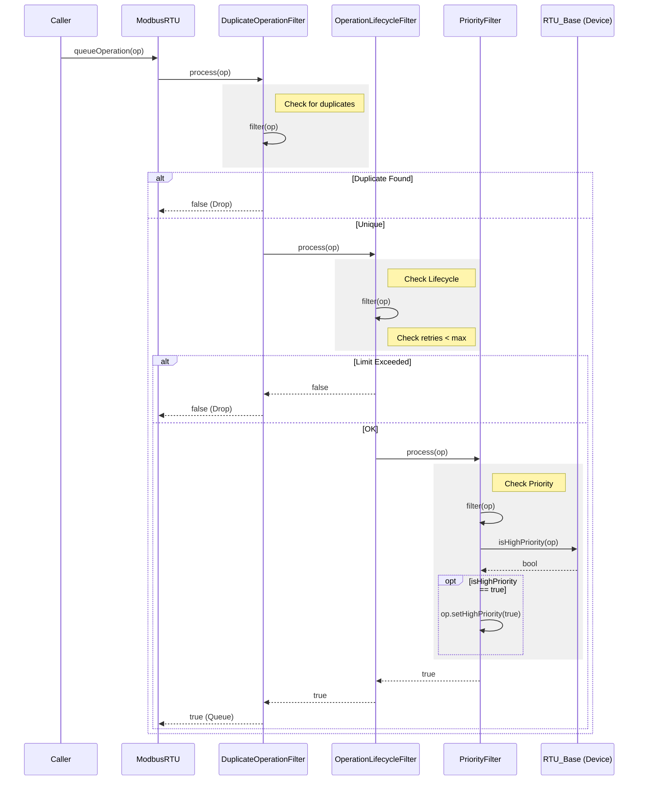

# Modbus RTU Operation Filtering

The Modbus RTU filter system uses a **Chain of Responsibility** pattern to process `ModbusOperation`s before they are added to the execution queue. This allows for modular validation, modification, and management of operations.

## Architecture

Each filter implements the `ModbusOperationFilter` interface. The `process(ModbusOperation &op)` method passes the operation through the current filter's `filter()` logic and, if successful, forwards it to the next filter in the chain.

### Filter Interface

```cpp
class ModbusOperationFilter {
    // ...
    // Process the operation through this filter and subsequent filters
    bool process(ModbusOperation &op) {
        if (!filter(op)) return false; // Stop if this filter rejects
        if (nextFilter) return nextFilter->process(op); // Pass to next
        return true; // End of chain, accepted
    }

    // Abstract method to be implemented by concrete filters
    virtual bool filter(ModbusOperation &op) = 0;
};
```

## Active Filters

The current filter chain is configured in `ModbusRTU` constructor as follows:
1.  **DuplicateOperationFilter**
2.  **OperationLifecycleFilter**
3.  **PriorityFilter**

### 1. DuplicateOperationFilter
**Purpose**: Prevents the queue from filling up with identical requests.
**Logic**: Checks if an operation with the same `type`, `slaveId`, `address`, and `value` (for writes) is already pending in the `ModbusRTU` queue.
**Action**: Returns `false` (drops operation) if a duplicate is found.

### 2. OperationLifecycleFilter
**Purpose**: Enforces operation validity limits.
**Logic**: Checks if `op.retries` has exceeded `maxRetries`.
**Action**: Returns `false` (drops operation) if limits are exceeded.

### 3. PriorityFilter
**Purpose**: Dynamically assigns priority to operations based on device-specific logic.
**Logic**:
1.  Retrieves the target `RTU_Base` device instance using `Manager::getDeviceById(slaveId)`.
2.  Calls `device->isHighPriority(op)` to ask the device if this specific operation is critical.
3.  If `true`, sets the `OP_HIGH_PRIORITY_BIT` on the operation.
**Action**: Always returns `true` (modifies operation but doesn't drop it).

## Flow Diagram


