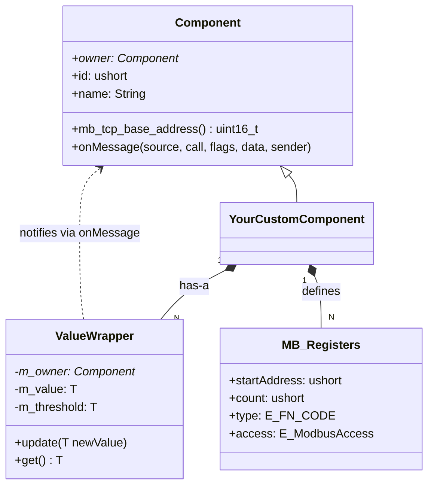
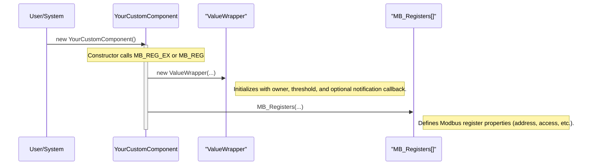
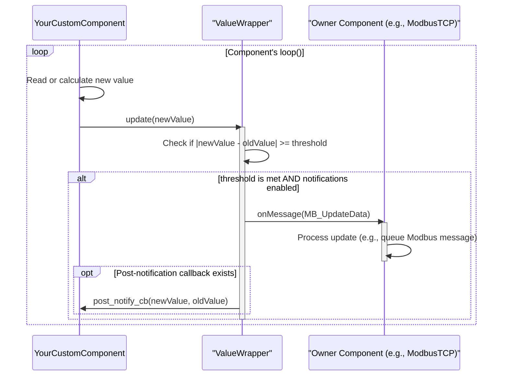

# ValueWrapper and Modbus Block Synchronization

This document outlines a streamlined mechanism for synchronizing component state with the Modbus TCP interface using the `ValueWrapper` class and a unifying macro, `MB_REG_EX`. This pattern reduces boilerplate code, improves readability, and centralizes the logic for value-change detection and notification.

## Core Concepts

The system is built on three key components:

1.  **`ValueWrapper<T>`**: A template class that wraps a value of type `T`. It monitors the value for significant changes (based on a configurable threshold) and triggers a notification to its owner component when such a change occurs.
2.  **`MB_Registers`**: A structure that defines a Modbus register block, including its address, function code, and access permissions.
3.  **`MB_REG_EX` / `MB_REG`**: Macros that initialize both a `ValueWrapper` instance and its corresponding `MB_Registers` entry in a single, atomic operation within a component's constructor.

### Class Relationships

The following diagram illustrates how these components relate to a custom component that uses them.



A custom component derives from `Component` and owns its `ValueWrapper` instances. When a `ValueWrapper` detects a change, it uses its owner pointer to send an `onMessage` notification, carrying the updated Modbus data.

## Initialization and Runtime Flow

The entire process, from initialization to a runtime update, is designed to be efficient and straightforward.

### Initialization Sequence

The `MB_REG_EX` or `MB_REG` macro is the cornerstone of the setup process. It must be called from within a component's constructor body (not the initializer list).



### Runtime Update Sequence

During normal operation, the component's `loop()` method is responsible for feeding new values to the `ValueWrapper`. The wrapper handles the rest.



## How to Use `MB_REG` and `MB_REG_EX`

To implement this pattern, follow these steps:

1.  Declare the `ValueWrapper<T>` members in your component's header file. They will be default-initialized.
2.  In the component's constructor, call the appropriate macro (`MB_REG` or `MB_REG_EX`) for each wrapped value.

### Macro Signatures

#### `MB_REG_EX` (Extended)
The extended macro allows for fine-grained control over all parameters, including the slave ID and whether notifications are enabled.
```cpp
MB_REG_EX(
    vw_member,             // The ValueWrapper member variable
    mb_blocks_array,       // The MB_Registers array
    vw_type,               // The data type (e.g., PlotStatus, int16_t)
    mb_reg_offset_enum,    // The register offset enum value
    mb_fn_code,            // The Modbus function code
    mb_access,             // Read/write access (MB_ACCESS_...)
    mb_slave_id,           // The slave ID
    mb_desc,               // A description string
    mb_group,              // A group name string
    vw_initial_val,        // The wrapper's initial value
    vw_threshold_val,      // The threshold for notification
    vw_threshold_mode,     // DIFFERENCE or INTERVAL_STEP
    vw_enable_notification,// true to enable notifications, false to disable
    vw_post_notify_cb      // An optional post-notification callback (or nullptr)
);
```

#### `MB_REG` (Simple)
The simple macro is a convenience for the most common use case. It assumes notifications are **enabled** and the **slave ID is 1**.
```cpp
MB_REG(
    vw_member,             // The ValueWrapper member variable
    mb_blocks_array,       // The MB_Registers array
    vw_type,               // The data type (e.g., PlotStatus, int16_t)
    mb_reg_offset_enum,    // The register offset enum value
    mb_fn_code,            // The Modbus function code
    mb_access,             // Read/write access (MB_ACCESS_...)
    mb_desc,               // A description string
    mb_group,              // A group name string
    vw_initial_val,        // The wrapper's initial value
    vw_threshold_val,      // The threshold for notification
    vw_threshold_mode,     // DIFFERENCE or INTERVAL_STEP
    vw_post_notify_cb      // An optional post-notification callback (or nullptr)
);
```

### Example Implementation

Here is a conceptual example based on `TemperatureProfile`. Since it needs to configure notification enablement, it uses `MB_REG_EX`.

```cpp
// TemperatureProfile.h
class TemperatureProfile : public PlotBase {
    // ...
private:
    ValueWrapper<PlotStatus> _statusWrapper;
    ValueWrapper<int16_t> _currentTemperatureWrapper;
    // ...
    MB_Registers _modbusBlocks[TEMP_PROFILE_REGISTER_COUNT];
};

// TemperatureProfile.cpp
TemperatureProfile::TemperatureProfile(Component *owner, short slot, ushort componentId)
    : PlotBase(owner, componentId),
      // _statusWrapper is default-initialized here
      // ...
{
    name = "TempProfile_" + String(this->id) + "_Slot_" + String(slot);
    const char* group = name.c_str();

    // Now, initialize the wrapper and the Modbus block together
    MB_REG_EX(
        _statusWrapper,
        _modbusBlocks,
        PlotStatus,
        TemperatureProfileRegisterOffset::STATUS,
        E_FN_CODE::FN_READ_HOLD_REGISTER,
        MB_ACCESS_READ_ONLY,
        1, // slaveId
        "TProf Status",
        group,
        PlotStatus::IDLE,
        PlotStatus::RUNNING, // Threshold: notify when value becomes RUNNING
        ValueWrapper<PlotStatus>::ThresholdMode::DIFFERENCE,
        true,           // Enable notifications
        nullptr         // No post-notification callback
    );

    MB_REG_EX(
        _currentTemperatureWrapper,
        _modbusBlocks,
        int16_t,
        TemperatureProfileRegisterOffset::CURRENT_TEMP,
        E_FN_CODE::FN_WRITE_HOLD_REGISTER,
        MB_ACCESS_READ_ONLY, // This block is RO from Modbus master perspective
        1, // slaveId
        "TProf Curr Temp",
        group,
        INT16_MIN,
        1, // Threshold: notify if value changes by at least 1
        ValueWrapper<int16_t>::ThresholdMode::DIFFERENCE,
        false,          // Disable notifications for this wrapper
        nullptr
    );

    // ... initialize other blocks
}

// In the loop method
void TemperatureProfile::loop() {
    // ...
    _statusWrapper.update(getCurrentStatus());
    _currentTemperatureWrapper.update(getTemperature(getElapsedMs()));
    // ...
}
```

By setting `vw_enable_notification` to `false` in `MB_REG_EX`, the `ValueWrapper` still tracks the value and holds state, but its `update` method will not trigger an `onMessage` call, effectively decoupling it from the Modbus notification system while still allowing its use as a stateful wrapper. 