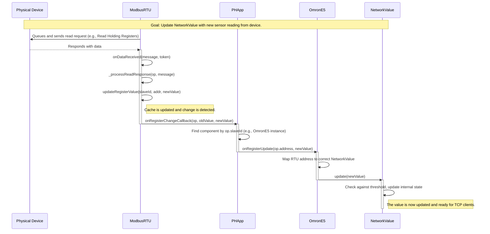
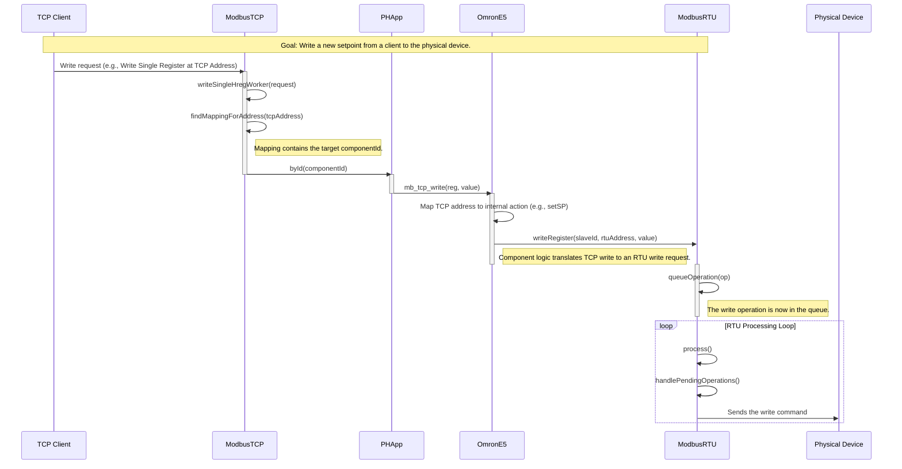
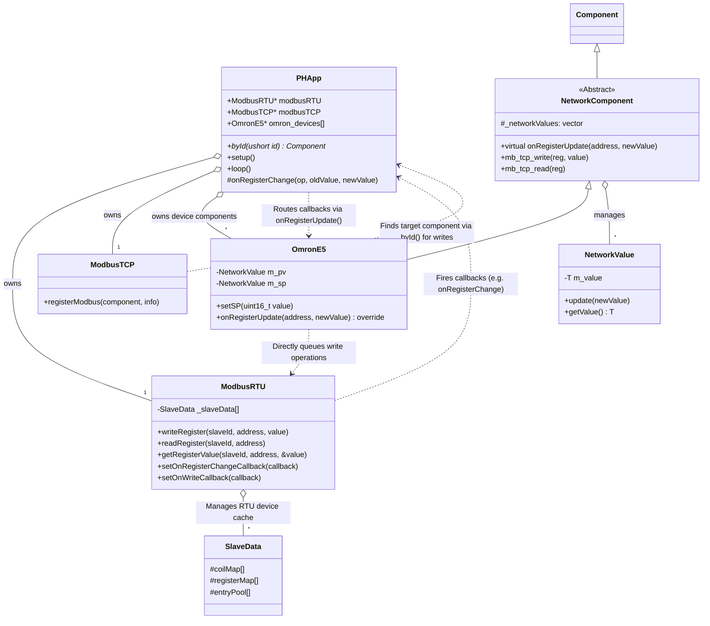

# Modbus Implementation Analysis & TODOs

## 1. Executive Summary

The current Modbus RTU and TCP implementation is functional but suffers from several architectural issues that impact performance, scalability, and reliability. Key problems include inefficient data lookups due to linear searches, overly complex and redundant state management abstractions, and a lack of support for transactional operations.

This document outlines these issues and provides a roadmap for both immediate, tactical improvements and long-term strategic changes to create a faster, more robust, and transactional Modbus subsystem.

## 2. Identified Issues & Bottlenecks

### 2.1. Useless Abstractions & State Duplication

The separation between `ModbusRTU`'s cache (`SlaveData`, `ModbusValueEntry`) and the `RTU_Base`/`RegisterState` classes creates an unnecessary and confusing layer of abstraction.

-   **State is duplicated:** The value of a register is stored in both a `ModbusValueEntry` inside `ModbusRTU` and a `RegisterState` object owned by a `RTU_Base` device. This increases memory usage and creates synchronization complexity.
-   **Complex Data Flow:** An update flows from the `ModbusRTU` cache, triggers a callback to the `Manager`, which then finds the `RTU_Base` device, which then updates its internal `RegisterState`. This is indirect and inefficient.
-   **High Overhead:** The `RTU_Base` and `RegisterState` classes introduce significant object-oriented overhead for what is fundamentally a simple register map. Each register becomes a heap-allocated object, which can be slow and lead to memory fragmentation on an embedded system.

This abstraction is "useless" because it doesn't provide significant benefits to outweigh its complexity and performance costs. A flatter, more direct data model is needed.

### 2.2. Inefficient Data Lookups (Performance Bottleneck)

Multiple critical code paths rely on linear iteration through arrays to find data. This is a major performance bottleneck, especially as the number of slaves and registers grows.

-   `ModbusRTU::findCoilEntry`/`findRegisterEntry`: Iterates through `MAX_ADDRESSES_PER_SLAVE` entries to find a cached value.
-   `ModbusTCP::findMappingForAddress`: Iterates through all registered `MB_Registers` blocks to map a TCP address.
-   `Manager::getDeviceById`: Iterates through an array to find a device pointer.

These O(n) operations are called frequently and will slow down the entire system under load.

### 2.3. Non-Transactional Operations

The user explicitly requested "transactional" capabilities. The current system is not transactional. Each read/write is a discrete operation queued and executed independently. There is no mechanism to:

-   Group multiple operations (e.g., a read-modify-write sequence) to ensure they execute without interruption.
-   Roll back a series of operations if one fails.
-   Ensure a consistent view of data across multiple registers at a single point in time.

This makes it difficult to implement complex control logic that relies on atomic updates to multiple registers.

### 2.4. Sequential Operation Queue (Performance Bottleneck)

The `ModbusRTU::operationQueue` is processed sequentially by the main `loop()`. The `handlePendingOperations` function finds and executes only *one* operation per call. This can lead to high latency for operations if the queue is long, as each operation must wait for the `minOperationInterval` plus the processing time of all preceding operations.

## 3. Short-Term Solutions (Tactical Fixes)

These solutions can be implemented quickly to get immediate performance gains.

### 3.1. Solution: Optimize Data Lookups

Replace the linear search for cached register values in `ModbusRTU` with a more efficient data structure. Since this is an embedded system, we should avoid dynamic memory allocation found in `std::map`. A statically-allocated hash map is a good compromise.

**Code Example: A simple hash map for `SlaveData`**

This requires modifying `ModbusTypes.h` to change the `SlaveData` structure.

```cpp:lib/polymech-base/src/modbus/ModbusTypes.h
// ... existing code ...
#include "constants.h"
#include "config-modbus.h"

// --- HASH MAP CONFIG FOR SLAVE DATA ---
#define SLAVE_DATA_MAP_SIZE (MAX_ADDRESSES_PER_SLAVE * 2) // Simple hash map size

// Structure to represent a register or coil value entry
struct ModbusValueEntry
{
// ... existing code ...
    uint16_t address;         // 2 bytes
    uint16_t value;           // 2 bytes
    uint8_t flags;            // 1 byte for flags (used, synchronized)
    ModbusValueEntry* next;   // Pointer for separate chaining in case of collision
// ... existing code ...
    ModbusValueEntry()
        : lastUpdate(0), address(0), value(0), flags(0), next(nullptr) {}

    ModbusValueEntry(uint16_t addr, uint16_t val, bool sync = true)
        : lastUpdate(millis()), address(addr), value(val), flags(0), next(nullptr)
// ... existing code ...
};

// Structure to represent a Modbus slave's data
struct SlaveData
{
    // --- NEW HASH MAP IMPLEMENTATION ---
    ModbusValueEntry entryPool[MAX_ADDRESSES_PER_SLAVE * 2]; // Pool of entries for coils and registers
    ModbusValueEntry* coilMap[SLAVE_DATA_MAP_SIZE];
    ModbusValueEntry* registerMap[SLAVE_DATA_MAP_SIZE];
    uint16_t entryPoolIndex;
    // --- END NEW HASH MAP ---

    uint8_t coilCount;
    uint8_t registerCount;
    uint8_t slaveId;

    SlaveData() : entryPoolIndex(0), coilCount(0), registerCount(0), slaveId(0)
    {
        clear();
    }

    void clear()
    {
        entryPoolIndex = 0;
        coilCount = 0;
        registerCount = 0;
        slaveId = 0;
        // Initialize hash maps to nullptr
        for (int i = 0; i < SLAVE_DATA_MAP_SIZE; ++i) {
            coilMap[i] = nullptr;
            registerMap[i] = nullptr;
        }
        // Invalidate all entries in the pool
        for (int i = 0; i < MAX_ADDRESSES_PER_SLAVE * 2; ++i) {
            CBI(entryPool[i].flags, OP_USED_BIT);
        }
    }

    // Simple hash function
    static uint16_t hash(uint16_t address) {
        return address % SLAVE_DATA_MAP_SIZE;
    }
};

// ... existing code ...
```

You would then update `ModbusRTU::findRegisterEntry`, `createRegisterEntry` and their coil counterparts to use this hash map, which would change the lookup from O(n) to O(1) on average.

### 3.2. Solution: Flatten the Abstraction

Deprecate the `RTU_Base` and `RegisterState` classes for state management. Interact with the `ModbusRTU` cache directly from your main application logic or components. This eliminates state duplication and simplifies the data flow significantly.

**Code Example: Direct interaction**

```cpp
// In your main application logic or a component that needs to write a value
void setHeaterTemperature(ModbusRTU& modbus, uint8_t slaveId, uint16_t temp)
{
    uint16_t address = 0x100A; // Address for heater setpoint

    // The component logic now directly queues the write operation.
    // The ModbusRTU class handles caching, retries, etc.
    modbus.writeRegister(slaveId, address, temp);
}

// In your main loop, to read a value
void checkHeaterStatus(ModbusRTU& modbus, uint8_t slaveId)
{
    uint16_t address = 0x200B; // Address for heater status
    uint16_t status;

    // Directly get the value from the ModbusRTU cache.
    // The return value indicates if the value is available in the cache.
    if (modbus.getRegisterValue(slaveId, address, status)) {
        if (status == 1) {
            // Heater is on
        }
    } else {
        // Value not yet synchronized, maybe queue a read
        modbus.readRegister(slaveId, address);
    }
}
```

This change simplifies the architecture by removing an entire layer of objects and indirect calls.

## 4. Long-Term Solutions (Strategic Changes)

### 4.1. Solution: Implement Transactional Operations

Modify the queuing mechanism to support transactions. A transaction would be an atomic group of operations.

1.  **Define a `ModbusTransaction` struct:** This struct would contain an array of `ModbusOperation`s.
2.  **Change the Queue:** The `operationQueue` in `ModbusRTU` would become a queue of `ModbusTransaction` pointers.
3.  **Update `handlePendingOperations`:** The loop would grab the next transaction from the queue and execute all operations within it sequentially, without allowing other operations to interrupt. If any operation in the transaction fails, the entire transaction is marked as failed.

**Conceptual Code:**

```cpp
// In ModbusTypes.h
struct ModbusTransaction {
    ModbusOperation operations[MAX_OPS_PER_TRANSACTION];
    uint8_t opCount;
    // ... other metadata like transaction ID, status, etc.
};

// In ModbusRTU.h
class ModbusRTU {
    // ...
private:
    ModbusTransaction transactionQueue[MAX_PENDING_TRANSACTIONS];
    // ...
};
```

This architectural change is significant but is the only robust way to meet the "transactional" requirement.

### 4.2. Solution: Overhaul State Management

As a long-term goal, create a single, unified data model for all Modbus state (both RTU and TCP). This could be a "global register map" implemented as a single contiguous block of memory or a more sophisticated data structure.

-   **Single Source of Truth:** All components read from and write to this central map.
-   **Efficient Access:** The map would be indexed directly by address, providing O(1) access.
-   **Gateway Logic:** The `ModbusTCP` and `ModbusRTU` classes become stateless gateways that simply translate requests into reads/writes on this central map.
-   **Synchronization:** A separate mechanism (like a dirty flag system) would trigger RTU writes when values in the map are changed by the application logic.

This would represent a fundamental shift from the current object-oriented, distributed state model to a centralized, data-centric one, leading to massive gains in performance and simplicity.

## 5. Bidirectional Data Flow Diagrams

Based on the refined architecture (`App` -> `NetworkComponent` -> `NetworkValue`), these diagrams model the two primary data flow directions.

### 5.1. Data Flow: From Device to Controller (RTU -> TCP)

This diagram shows how a value read from a physical RTU device gets updated internally, making it available for a Modbus TCP client to read.



### 5.2. Data Flow: From Controller to Device (TCP -> RTU)

This diagram shows how a write command from a Modbus TCP client gets propagated down to the physical RTU device.



## 6. Verifying a Transaction (`setSP` Example)

Verifying that a write operation is truly complete requires more than just sending a command. A robust verification process confirms that the device has not only acknowledged the command but has also correctly updated its internal state. The most reliable method for this is a **Read-After-Write** sequence.

This process involves two phases:
1.  **Write Acknowledgment**: Confirming the device received the write command.
2.  **Value Confirmation**: Reading the value back from the device to ensure it matches the value that was written.

The following diagram illustrates this closed-loop verification flow for setting an Omron SP.

```mermaid
sequenceDiagram
    participant AppLogic as "App Logic (e.g., OmronE5)"
    participant ModbusRTU
    participant PhysicalDevice as "Omron Device"

    Note over AppLogic, PhysicalDevice: Goal: Set SP to 150 and verify it was written correctly.

    AppLogic->>ModbusRTU: writeRegister(slaveId, SP_Address, 150)
    AppLogic->>AppLogic: state = WAITING_WRITE_ACK; pendingSP = 150

    ModbusRTU->>PhysicalDevice: Sends write command
    PhysicalDevice-->>ModbusRTU: Write Acknowledged

    activate ModbusRTU
    ModbusRTU->>ModbusRTU: onDataReceived() for write
    ModbusRTU->>AppLogic: onWriteCallback(op for SP write)
    deactivate ModbusRTU

    activate AppLogic
    AppLogic->>AppLogic: if (op.address == SP_Address and state == WAITING_WRITE_ACK)
    AppLogic->>ModbusRTU: readRegister(slaveId, SP_Address)
    AppLogic->>AppLogic: state = WAITING_READ_VERIFY
    deactivate AppLogic

    ModbusRTU->>PhysicalDevice: Sends read command
    PhysicalDevice-->>ModbusRTU: Responds with SP value

    activate ModbusRTU
    ModbusRTU->>ModbusRTU: onDataReceived() for read
    ModbusRTU->>AppLogic: onRegisterChangeCallback(op, oldValue, newValue)
    deactivate ModbusRTU

    activate AppLogic
    AppLogic->>AppLogic: if (op.address == SP_Address and state == WAITING_READ_VERIFY)
    AppLogic->>AppLogic: if (newValue == pendingSP) -> SUCCESS!
    AppLogic->>AppLogic: else -> FAILED!
    AppLogic->>AppLogic: state = IDLE
    deactivate AppLogic
```

### Implementation Notes

-   **State Management**: The component initiating the write (`OmronE5` in this case) needs a simple state machine to track the verification process (e.g., `IDLE`, `WAITING_WRITE_ACK`, `WAITING_READ_VERIFY`).
-   **Callback Logic**: The core logic is implemented in the `onWriteCallback` and `onRegisterChangeCallback` handlers. These handlers must inspect the incoming `ModbusOperation` to ensure they are acting on the correct address for the correct slave.
-   **Flattened Abstraction**: This verification model works best with the "Flatten the Abstraction" approach, where the `OmronE5` component interacts directly with `ModbusRTU` and its callbacks, rather than going through the `RTU_Base` layer.
 
## 7. Proposed New Class Design

Based on the goal of flattening the architecture, this new class design eliminates the `RTU_Base`, `RegisterState`, and `Manager` abstractions. `PHApp` becomes the central orchestrator connecting the Modbus services (`ModbusRTU`, `ModbusTCP`) to the various `NetworkComponent`s that represent devices.

### 7.1. Class Diagram



### 7.2. Key Changes in this Design

1.  **`RTU_Base` is Eliminated**: `OmronE5` now inherits directly from `NetworkComponent` (which inherits from `Component`), removing the complex and RTU-specific `RTU_Base` class.
2.  **`RegisterState` is Eliminated**: The state of a register is held in two places only: the `ModbusRTU` cache (`SlaveData`) as the ground truth from the bus, and the `NetworkValue` within the specific component (`OmronE5`) for application logic. There is no third, intermediate `RegisterState` object.
3.  **`Manager` is Eliminated**: The `Manager` class, which was responsible for routing callbacks to `RTU_Base` devices, is no longer needed.
4.  **`PHApp` as the Router**: `PHApp` takes on the role of the central router. It subscribes to `ModbusRTU`'s callbacks. When a register changes, `PHApp` receives the callback, identifies which device component is affected (based on slave ID), and calls a method like `onRegisterUpdate()` on that specific component instance.
5.  **Direct Command Path**: When `OmronE5` needs to write a value (e.g., in its `setSP` method), it now calls `modbusRTU->writeRegister()` directly, rather than manipulating an internal `RegisterState` and waiting for a sync loop.

This new architecture is much cleaner, reduces memory overhead, and aligns with the data flow diagrams. It makes the system more performant and easier to reason about.
