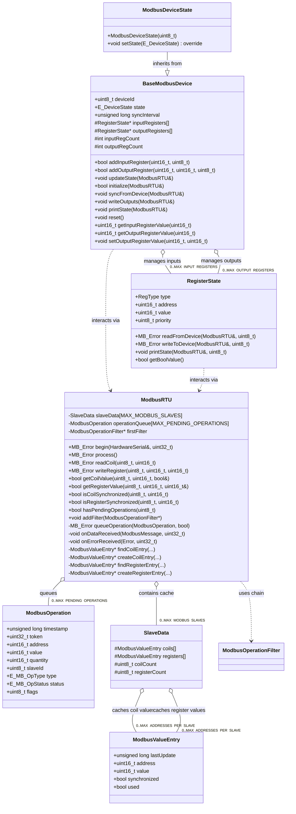
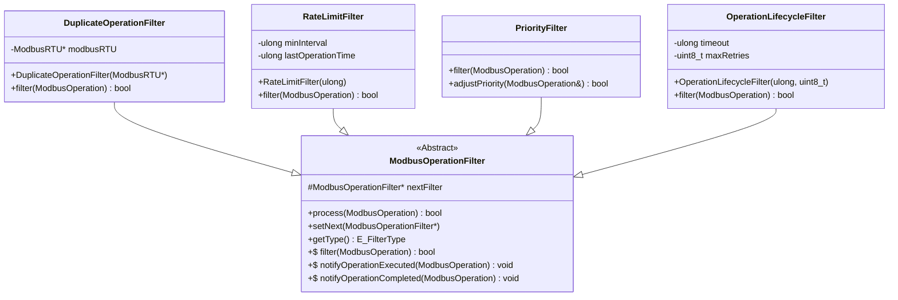

# Modbus RTU Client Subsystem Documentation

## Overview

This document describes the classes, structures, and enums involved in the Modbus RTU Client functionality within the firmware. This subsystem is primarily managed by the `ModbusRTU` class and is responsible for communicating with downstream Modbus RTU slave devices over a serial (RS485) connection. It often works in conjunction with the Modbus TCP server (`ModbusManager`) to act as a TCP-to-RTU gateway.

The core tasks include queuing read/write operations, managing communication timing, handling retries and errors, caching slave data, and providing an interface to interact with the RTU devices.

## Key Classes

### `ModbusRTU`

*   **Header:** `src/ModbusRTU.h`
*   **Source:** `src/ModbusRTU.cpp`
*   **Purpose:** The central class managing Modbus RTU client communication. It uses the `eModbus` library's `ModbusClientRTU` internally.
*   **Responsibilities:**
    *   Initializes the RTU client and serial port.
    *   Manages a queue (`operationQueue`) of pending `ModbusOperation` requests.
    *   Handles the execution of operations, respecting timing intervals (`minOperationInterval`).
    *   Processes responses and errors from the `eModbus` library via callbacks (`onDataReceived`, `onErrorReceived`).
    *   Maintains a cache (`slaveData`) of the last known values for registers and coils on each slave device using `SlaveData` and `ModbusValueEntry`.
    *   Provides public methods (`readCoil`, `writeRegister`, etc.) to queue operations.
    *   Manages an optional filter chain (`ModbusOperationFilter`) to preprocess outgoing operations (e.g., prevent duplicates, rate limit).
    *   Provides status information (error counts, success rates).
    *   Handles adaptive timing adjustments if `ENABLE_ADAPTIVE_TIMEOUT` is defined.

### `BaseModbusDevice`

*   **Header:** `src/ModbusTypes.h`
*   **Source:** `src/ModbusTypes.cpp`
*   **Purpose:** Represents the state and basic interaction logic for a single external Modbus RTU slave device being managed by `ModbusRTU`.
*   **Responsibilities:**
    *   Stores the slave ID (`deviceId`).
    *   Tracks the device's communication state (`E_DeviceState`: IDLE, RUNNING, ERROR).
    *   Manages communication timing (timeout, sync interval) and error counts for the specific device.
    *   Holds collections (`inputRegisters`, `outputRegisters`) of `RegisterState` objects representing the data points on the slave.
    *   Provides methods to add/manage `RegisterState` objects (`addInputRegister`, `addOutputRegister`).
    *   Provides methods to interact with the device's registers via the `ModbusRTU` manager (`initialize`, `syncFromDevice`, `writeOutputs`).
    *   Provides local accessors for register values (`getInputRegisterValue`, `getOutputRegisterValue`, `setOutputRegisterValue`).
    *   Includes helper methods for state management (`printState`, `reset`, `runTestSequence`).

### `ModbusDeviceState`

*   **Header:** `src/ModbusDeviceState.h`
*   **Source:** `src/ModbusDeviceState.cpp`
*   **Purpose:** A derived class of `BaseModbusDevice`. Intended for application-specific implementations or specializations of Modbus RTU slave devices.
*   **Responsibilities:**
    *   Currently, mainly overrides `setState` to add specific logging.
    *   Its constructor can be used to add specific default registers required by the application logic using the `addInputRegister`/`addOutputRegister` methods inherited from `BaseModbusDevice`.

### `RegisterState`

*   **Header:** `src/ModbusTypes.h`
*   **Source:** `src/ModbusTypes.cpp`
*   **Purpose:** Represents a single data point (Input Register, Holding Register, Coil, or Discrete Input) on an external Modbus RTU slave device.
*   **Responsibilities:**
    *   Stores the register type (`RegType`), Modbus address, current value, min/max values (for validation), and priority.
    *   Provides methods (`readFromDevice`, `writeToDevice`) to queue corresponding read/write operations via the `ModbusRTU` manager.
    *   Includes helper methods for boolean conversion (`getBoolValue`, `setBoolValue`) and printing state (`printState`).

## Supporting Structures

### `ModbusOperation`

*   **Header:** `src/ModbusTypes.h`
*   **Purpose:** Represents a single Modbus read or write request waiting to be executed or currently in progress. Stored in the `ModbusRTU`'s `operationQueue`.
*   **Key Members:**
    *   `timestamp`: When the operation was created.
    *   `token`: Unique identifier used by `eModbus` library for asynchronous handling.
    *   `address`, `value`, `quantity`: Modbus request parameters.
    *   `slaveId`: Target slave device.
    *   `type`: The type of operation (`E_MB_OpType`).
    *   `status`: Current status (`E_MB_OpStatus`: PENDING, SUCCESS, FAILED, RETRYING).
    *   `retries`: Number of times execution has been attempted.
    *   `flags`: Bit flags indicating state (USED, HIGH_PRIORITY, IN_PROGRESS, BROADCAST, SYNCHRONIZED).

### `ModbusValueEntry`

*   **Header:** `src/ModbusTypes.h`
*   **Purpose:** Represents a cached value for a single register or coil address on a specific slave. Used within the `SlaveData` structure.
*   **Key Members:**
    *   `address`: The Modbus address.
    *   `value`: The last known value.
    *   `lastUpdate`: Timestamp of the last update.
    *   `synchronized`: Flag indicating if the cached value is believed to be in sync with the device.
    *   `used`: Flag indicating if this entry is actively used.

### `SlaveData`

*   **Header:** `src/ModbusTypes.h`
*   **Purpose:** Holds the cached data for a single Modbus RTU slave device managed by `ModbusRTU`. An array of `SlaveData` is stored in `ModbusRTU`.
*   **Key Members:**
    *   `coils`: Fixed-size array of `ModbusValueEntry` for coils.
    *   `registers`: Fixed-size array of `ModbusValueEntry` for registers.
    *   `coilCount`, `registerCount`: Number of used entries in the arrays.

## Operation Filtering

### `ModbusOperationFilter` (Base Class)

*   **Header:** `src/ModbusTypes.h`
*   **Purpose:** Abstract base class for filters that can be chained together to process `ModbusOperation` requests before they are queued for execution by `ModbusRTU`.
*   **Key Methods:**
    *   `filter(op)`: Pure virtual method; derived classes implement logic here. Returns `true` to allow the operation, `false` to drop it.
    *   `process(op)`: Processes the operation through the current filter and the rest of the chain.
    *   `setNext(filter*)`, `getNext()`: Manage the filter chain links.
    *   `notifyOperationExecuted(op)`, `notifyOperationCompleted(op)`: Optional methods for stateful filters.
    *   `getType()`: Returns the filter type (`E_FilterType`).

### Derived Filter Classes

*   **Header:** `src/ModbusTypes.h`
*   **Source:** `src/ModbusTypes.cpp`
*   **Classes:**
    *   `DuplicateOperationFilter`: Prevents queuing an operation if an identical one (same slave, type, address) is already pending in the `ModbusRTU` queue. Requires a pointer to the `ModbusRTU` instance.
    *   `RateLimitFilter`: Enforces a minimum time interval between consecutive operations passing through it.
    *   `PriorityFilter`: Currently a placeholder; intended to potentially adjust operation priority flags (though filtering itself always returns true).
    *   `OperationLifecycleFilter`: Drops operations that have exceeded `MAX_RETRIES` or have timed out (`OPERATION_TIMEOUT`).

## Key Enums

*   **`E_MB_OpType`**: (`src/ModbusTypes.h`) Defines the type of Modbus operation (READ_COIL, WRITE_REGISTER, etc.).
*   **`E_MB_OpStatus`**: (`src/ModbusTypes.h`) Defines the status of a queued `ModbusOperation` (PENDING, SUCCESS, FAILED, RETRYING).
*   **`MB_Error`**: (`src/ModbusTypes.h`) Comprehensive error codes, combining standard Modbus exceptions, internal queue/operation errors, and `eModbus` communication errors.
*   **`E_FilterType`**: (`src/ModbusTypes.h`) Identifies the type of a `ModbusOperationFilter`.
*   **`E_DeviceState`**: (`src/ModbusTypes.h`) State of a `BaseModbusDevice` (IDLE, RUNNING, ERROR).
*   **`RegType`**: (`src/ModbusTypes.h`) Type of a `RegisterState` (INPUT, HOLDING, COIL, DISCRETE_INPUT).
*   **`E_InitState`**: (`src/ModbusRTU.h`) Internal state for the `ModbusRTU` class initialization process.

## Key Constants

*   **`MAX_MODBUS_SLAVES`**: (`src/ModbusTypes.h`) Max number of RTU slaves the client can manage.
*   **`MAX_ADDRESSES_PER_SLAVE`**: (`src/ModbusTypes.h`) Size of the `ModbusValueEntry` arrays within `SlaveData`.
*   **`MAX_PENDING_OPERATIONS`**: (`src/ModbusTypes.h`) Size of the `ModbusRTU` operation queue.
*   **`MAX_RETRIES`**: (`src/ModbusTypes.h`) Default max retries for a failing operation.
*   **`OPERATION_TIMEOUT`**: (`src/ModbusTypes.h`) Default timeout for an operation before being considered failed/expired by `OperationLifecycleFilter`.
*   **`BAUDRATE`**: (`src/ModbusTypes.h`) Default serial baud rate for RS485.
*   **`PRIORITY_*` Defines**: (`src/ModbusTypes.h`) Constants used for setting `RegisterState` priorities.
*   **`OP_FLAG_*` Defines**: (`src/ModbusTypes.h`) Bit flags used within `ModbusOperation.flags`.

## Callback Functions

*   **`ResponseCallback`**: (`src/ModbusTypes.h`) typedef `void (*ResponseCallback)(uint8_t slaveId)`. Can be set on `ModbusRTU` to trigger custom logic when *any* response (success or error) is received for a slave.
*   **`OnRegisterChangeCallback`**: (`src/ModbusTypes.h`) typedef `void (*OnRegisterChangeCallback)(const ModbusOperation& op, uint16_t oldValue, uint16_t newValue)`. Set on `ModbusRTU` to be notified when a successful read operation results in a changed value in the cache.
*   **`OnWriteCallback`**: (`src/ModbusTypes.h`) typedef `void (*OnWriteCallback)(const ModbusOperation& op)`. Set on `ModbusRTU` to be notified when a write operation completes successfully.
*   **`OnErrorCallback`**: (`src/ModbusTypes.h`) typedef `void (*OnErrorCallback)(const ModbusOperation& op, int errorCode, const char* errorMessage)`. Set on `ModbusRTU` to be notified when an operation fails (either timeout, Modbus exception, or internal error).

## Mermaid Diagrams

### Core Class Relationships

### Filter Chain Relationships

--- 