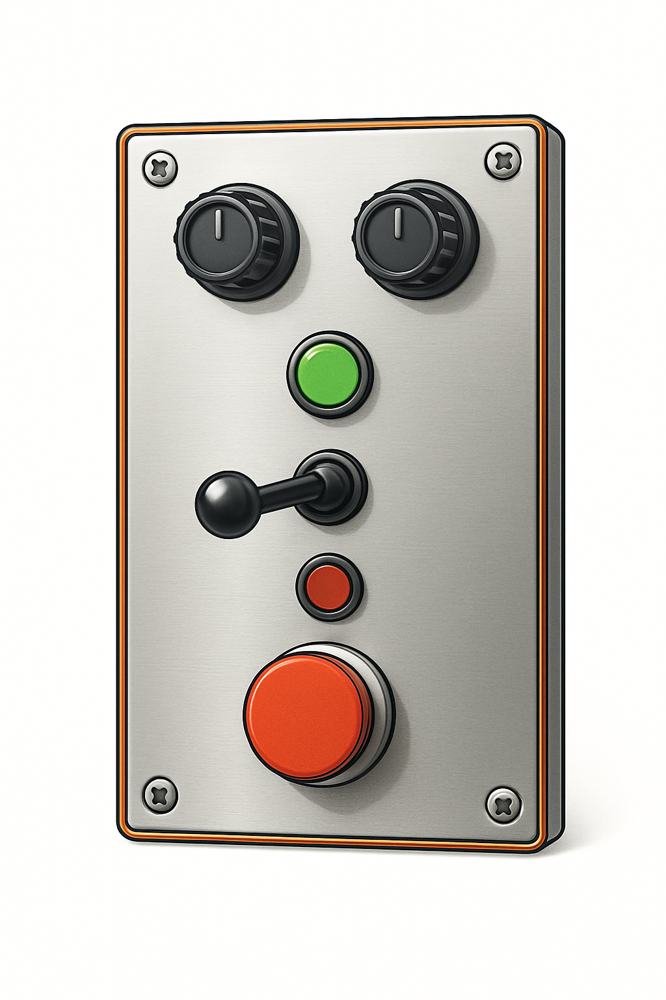
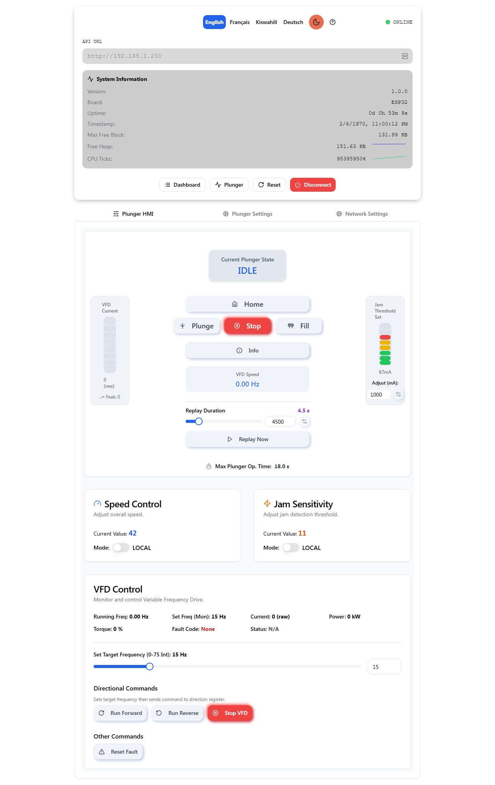

# Plunger Component - User Manual

This document describes how to operate the Plunger component using the joystick and understand its different modes.

## References

- [Plunger Settings](./plunger-settings.md.md)
- [Elena - RC2 - Official](https://polymech.io/en/store/products/injection/elena-zmax-rc1/)

## Joystick Operations

The joystick controls the primary functions of the plunger. Ensure the system is **not moving and ready for a new command** before initiating most new joystick actions. The Plunger component has an "Auto Mode" which can be enabled or disabled via separate commands (see Advanced Controls). When Auto Mode is enabled, holding the joystick in a direction for an extended period can trigger automatic continuous movement.

**Joystick Directions:**

*   **UP**: Move Plunger UP (Homing/Retracting)
*   **DOWN**: Move Plunger DOWN (Plunging/Extending)
*   **LEFT**: Initiate FILLING sequence
*   **RIGHT**: Initiate RECORD or REPLAY sequence
*   **CENTER**: Stop manual movement / Neutral position

---

### 1. Speed Control Dial (Potentiometer)

The Plunger is equipped with a speed control dial. This dial allows you to adjust the **downward plunging speed**.

*   **Function**: Turning the dial will increase or decrease the speed at which the plunger moves downwards during Manual Plunging, Automatic Plunging, Record mode, Replay mode, and the plunging phase of the Filling sequence.
*   **Note**: The upward homing speed (including during the Filling sequence's homing phase) is generally fixed at a slower, safer speed and is not affected by this dial.

---

### 2. Sensitivity Dial: How Quickly the Plunger Stops

This dial adjusts how sensitive the plunger is when it's moving **DOWN**. This changes how quickly it will stop if it hits something.

*   **What it does**: It tells the plunger how easily it should decide it's "stuck" or has "bumped into something" when moving downwards.

*   **How to use it**:

    *   **Turn for "Quick Stop" (Most Sensitive setting):**
        *   Imagine turning this dial all the way up (e.g., to a number like 100, or a symbol showing a quick stop 🛑).
        *   **Result**: The plunger becomes super alert! It will stop **immediately** the moment it touches anything in its path. It won't push hard; it will just stop right away.
        *   **Use this when**: You want the plunger to be extra careful and stop with just the slightest touch.

    *   **Turn for "Normal Stop" (Least Sensitive setting):**
        *   Imagine turning this dial all the way down (e.g., to a number like 0, or a symbol showing normal work 💪).
        *   **Result**: The plunger will use its normal pushing strength. It will push against things for a moment before deciding to stop. It won't stop for tiny, light bumps that it might otherwise push through.
        *   **Use this when**: It's okay for the plunger to push a bit to do its job, and you don't want it to stop for every tiny thing.

    *   **In-between settings**: You can choose a setting in the middle to get a balance that's just right for your task!

*   **Important**: This dial mostly changes how the plunger reacts when it's moving **DOWN** (plunging). It doesn't change how it moves when going up.

---

### 3. Manual Plunging (Moving Down)

*   **Action**: Push the joystick **DOWN**.
*   **Result**: The plunger will start moving downwards. The speed is determined by the **Speed Control Dial**.
    *   To continue moving manually, keep the joystick held DOWN.
    *   To stop manual movement, release the joystick to the **CENTER** position. The plunger will stop.
*   **Automatic Plunging (if "Auto Mode" is enabled)**:
    *   If you **continue to hold** the joystick **DOWN** for more than **3.5 seconds**, the plunger will switch to **Automatic Plunging** mode.
    *   Once in Automatic Plunging, you can release the joystick to the CENTER position, and the plunger will continue moving down at the speed set by the Speed Control Dial.
    *   **To stop Automatic Plunging**: Move the joystick to any other position (e.g., UP, LEFT, RIGHT, or briefly back to DOWN then CENTER). The plunger will stop.

### 4. Manual Homing (Moving Up)

*   **Action**: Push the joystick **UP**.
*   **Result**: The plunger will start moving upwards at a fixed slow speed.
    *   To continue moving manually, keep the joystick held UP.
    *   To stop manual movement, release the joystick to the **CENTER** position. The plunger will stop.
*   **Automatic Homing (if "Auto Mode" is enabled)**:
    *   If you **continue to hold** the joystick **UP** for more than **3.5 seconds**, the plunger will switch to **Automatic Homing** mode.
    *   Once in Automatic Homing, you can release the joystick to the CENTER position, and the plunger will continue moving up.
    *   **To stop Automatic Homing**: Move the joystick to any other position. The plunger will stop.

---

### 5. Filling Sequence

The filling sequence is an automated process: the plunger moves down until it senses the container is full (by detecting a jam), waits a moment, moves all the way up until it reaches the top (another jam), waits again, and then is ready for the next action.

The plunging (downward) speed during this sequence is affected by the Speed Control Dial. The upward (homing) speed is a fixed slow speed.

*   **Action**: When the plunger is **not moving and ready**, push and **HOLD** the joystick to the **LEFT** for at least **2.5 seconds**.
*   **Result - The Automated Sequence**:
    1.  The plunger will start moving **DOWN**.
    2.  When the plunger detects that the container is full (it senses a jam/resistance), it will automatically stop.
    3.  It will then **wait** in place for **1.3 seconds**.
    4.  After this short wait, it will automatically start moving **UP**.
    5.  When the plunger reaches its topmost position (it senses a jam/resistance at the top), it will automatically stop.
    6.  It will then **wait** in this top position for **1.5 seconds**.
    7.  After this final wait, the filling sequence is complete, and the plunger will be **ready for a new command**.
*   **To Abort Filling Sequence**: Once the filling sequence has started (after you've held the joystick left and then released it to the center), if you move the joystick in **ANY direction** away from the CENTER position, the entire filling sequence will be cancelled. The plunger will stop and become **ready for a new command**.

---

### 6. Record & Replay Plunge Duration

This feature allows you to record a specific plunging duration and then replay it. The plunging speed during record and replay is affected by the Speed Control Dial.

#### 6.1. Record Plunge Duration

*   **Action**: When the plunger is **not moving and ready**, push and **HOLD** the joystick to the **RIGHT** for at least **3 seconds**.
*   **Result**:
    1.  The plunger enters **Record Mode** and starts moving **DOWN** at the speed set by the dial.
    2.  Keep holding the joystick RIGHT for the desired duration of the plunge.
    3.  **Release the joystick** (to CENTER or any other direction) when you want to stop recording the plunge.
    4.  The duration of this plunge is now recorded. The plunger stops and is **ready for a new command**.
*   **Maximum Record Time**: The recording will automatically stop if it exceeds **20 seconds**.

#### 6.2. Replay Recorded Plunge

*   **Action**: When the plunger is **not moving and ready**, briefly **TAP** the joystick to the **RIGHT** (push and release quickly, holding for less than 3 seconds).
*   **Result**:
    1.  If a plunge duration has been previously recorded (or set via settings), the plunger enters **Replay Mode**.
    2.  It will automatically plunge **DOWN** for the recorded duration, at the speed set by the dial.
    3.  After the duration, it will stop and become **ready for a new command**.
    4.  The default replay duration if no recording has been made or loaded from settings is **4.5 seconds**.
*   **To Abort Replay**: During replay, moving the joystick in **ANY direction** away from CENTER will stop the replay, and the plunger will become **ready for a new command**.
*   **No Recording**: If you tap RIGHT and no duration has been recorded or set, nothing will happen.

---

### 7. Jammed State and Resetting

*   **Indication**: If the plunger encounters excessive resistance during any movement (manual, auto, fill, record, replay), it will become **jammed**, and the motor will stop.
*   **To Reset from a Jam**:
    1.  Ensure the joystick is in the **CENTER** position. The system is now attempting to clear the jam.
    2.  From this state, push the joystick **UP**. This will try to fully reset the VFD fault and start moving the plunger upwards manually.
    3.  If you move the joystick to any other direction (not UP) while it's attempting to clear a jam (after first centering it), it will also try to reset the VFD fault and then become **ready for a new command**. A manual VFD reset by a technician might sometimes be needed if this occurs and the VFD remains unresponsive.

---
## Notes

*   The exact timings mentioned are based on current default settings but **can be configured** via a settings file (see Advanced Controls section if available).
*   Adjust the **Speed Control Dial** to change the downward plunging speed for most operations.
*   Always ensure the area around the plunger is clear before operation.
*   Pay attention to system warnings or error messages if the plunger behaves unexpectedly. 
*   

## Web Interface

