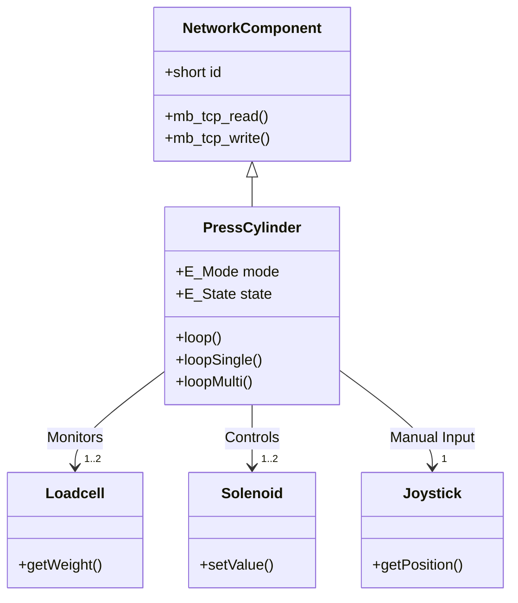
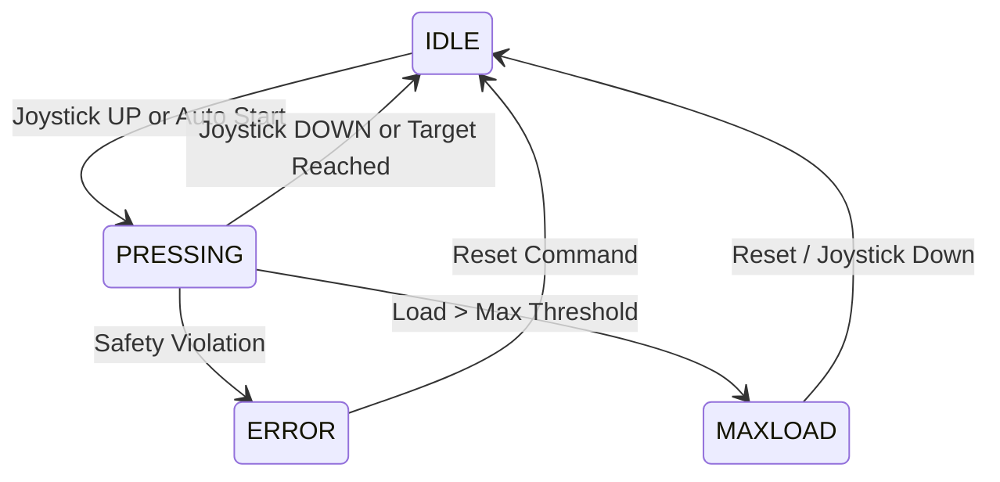
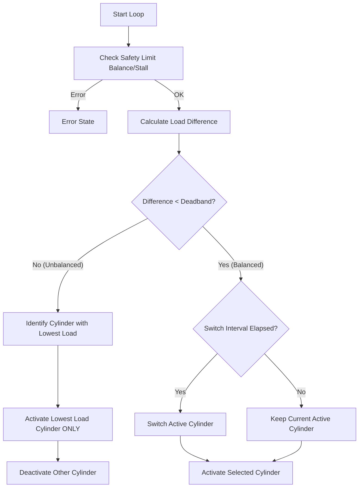
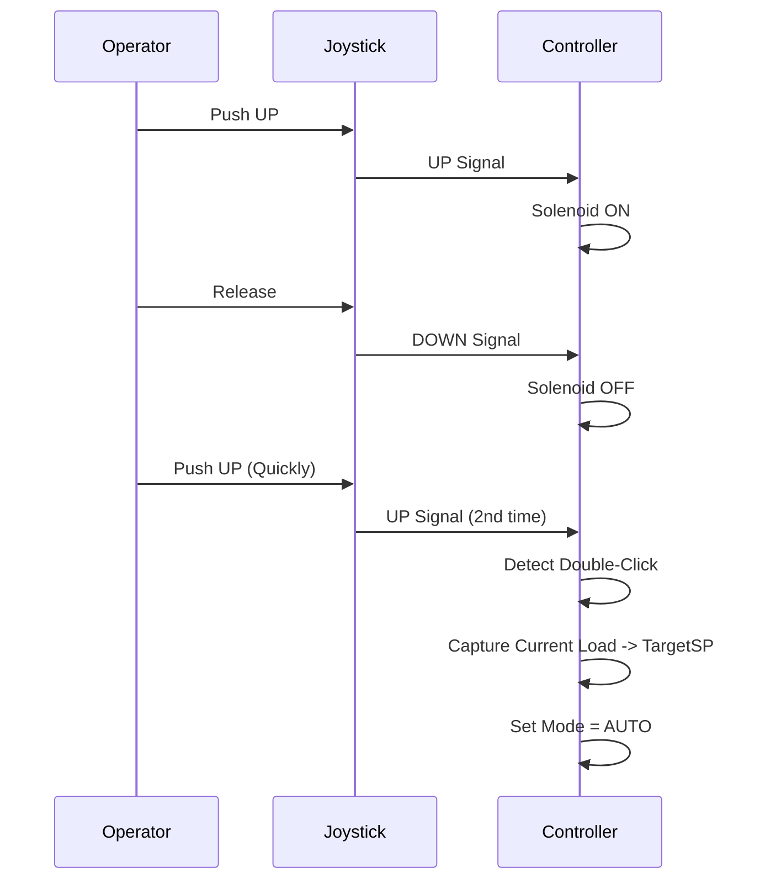

# Press Cylinder Component Documentation

The `PressCylinder` component is a high-level controller for hydraulic or electric press cylinders. It manages the interaction between **Loadcells** (input sensors) and **Solenoids** (output actuators) to achieve precise pressure control. It supports single and dual-cylinder configurations with various manual and automated modes.

## Architecture

The component inherits from `NetworkComponent` and exposes its state and configuration via Modbus TCP. It integrates a `Joystick` and `PushButton` for efficient manual control and safety overrides.



## Interface (Modbus Registers)

| Name | Type | Description |
|------|------|-------------|
| **Target SP** | RW | Target setpoint for Auto modes (0-100% of Max Load). |
| **Mode** | RW | Operation mode (Manual, Auto, etc.). |
| **State** | RO | Current state (Idle, Pressing, MaxLoad, Error). |
| **Error Code** | RO | Specific error reason (Overload, Stalled, etc.). |
| **CFlags** | RW | Configuration flags (Safety checks enable/disable). |
| **OutputMode** | RW | Special output triggers (e.g., HOLD). |
| **Interlocked**| RW | boolean flag indicating system readiness/safety interlock. |

## Operational Modes

The component operates in one of several modes, determined by the `m_mode` register.

| Mode ID | Name | Description |
|---------|------|-------------|
| 1 | **MANUAL** | Direct single-cylinder control via Joystick. |
| 2 | **AUTO** | Automatic single-cylinder press to Target SP. |
| 3 | **MANUAL_MULTI** | Direct dual-cylinder control (synchronized). |
| 4 | **AUTO_MULTI** | Automatic dual-cylinder press (simultaneous). |
| 5 | **AUTO_MULTI_BALANCED** | Automatic dual-cylinder press with load balancing. |

### State Machine Overview

The system transitions between high-level states based on safety checks and operation completion.



---

## Detailed Mode Logic

### 1. Manual Mode (Single & Multi)

In manual modes, the operator has direct control over the solenoids using the joystick.

* **Safety:** Stops immediately if `MAX_LOAD` is exceeded.
* **Response:** Joystick UP activates solenoid(s). Joystick DOWN/CENTER deactivates them.

**Pseudo Code:**

```python
if CheckMaxLoad(current_load):
    Stop()
    SetState(ERROR, OVERLOAD)
    return

if Joystick.Position == UP:
    Solenoid.On()
else:
    Solenoid.Off()
```

### 2. Auto Mode (Single)

Automatic pressing until a target load is reached. The solenoid remains active as long as the current load is below the target (minus deadband).

**Pseudo Code:**

```python
target_value = (MaxLoad * TargetSP_Percentage) / 100

if current_load < target_value:
    Solenoid.On()
else:
    Solenoid.Off()
```

### 3. Auto Multi (Simultaneous)

Both cylinders press simultaneously until the target is reached.

* **Stall Detection:** If solenoids are active but PV (load) doesn't increase, the system aborts.
* **Balance Safety:** If the difference between cylinders > `balance_max_pv_diff`, it aborts.

**Pseudo Code:**

```python
if Abs(Load_A - Load_B) > CriticalBalanceThreshold:
    TriggerError(BALANCE_MAX_DIFF)
    return

if DetectStall(Load_A, Load_B):
    TriggerError(STALLED)
    return

# Simple control: Press if below target
for cylinder in [A, B]:
    if cylinder.load < target_value:
        cylinder.Solenoid.On()
    else:
        cylinder.Solenoid.Off()
```

### 4. Auto Multi Balanced (Smart Balancing)

This is the most complex mode. It intelligently toggles cylinders to keep the load balanced while pressing. It prioritizes the cylinder with the *lowest* load to "catch up".

**Core Logic:**

1. **Check Balance:** Is the difference between cylinders within the acceptable deadband?
2. **Unbalanced Strategy:** Ignore the higher loaded cylinder. Actively press ONLY the cylinder with the lowest load to correct the imbalance.
3. **Balanced Strategy:** If balanced, toggle between cylinders periodically (e.g., every 3 seconds) or press both if perfectly matched, to maintain forward progress without creating new imbalances.
4. **Auto Advance:** If the system is balanced and making progress, the "Auto Timeout" timer is reset prevents nuisance timeouts during long press cycles.

**Flowchart:**



**Pseudo Code (Balanced):**

```python
min_load = Min(Load_A, Load_B)
max_load = Max(Load_A, Load_B)

# Safety Checks
if HasStalled(min_load): Abort(STALLED)
if (max_load - min_load) > MaxSafetyDiff: Abort(BALANCE_ERROR)

# Control Logic
if (max_load - min_load) > Deadband:
    # UNBALANCED: Catch up logic
    urgent_cylinder = CylinderWithLowestLoad()
    active_cylinder = urgent_cylinder # Force switch to urgent
else:
    # BALANCED: Alternating logic
    if TimeSinceLastSwitch > BalanceInterval:
        active_cylinder = Toggle(active_cylinder)
        ResetSwitchTimer()

# Apply Output
Activate(active_cylinder)
Deactivate(others)
```

## Safety Features

The component enforces strict safety rules via `CFlags` (Configuration Flags).

| Flag Name | ID | Function |
|-----------|----|----------|
| `CHECK_MINLOAD` | 1 | Prevents operation if load is missing (e.g. sensor broken/disconnected). |
| `CHECK_MAX_TIME`| 2 | Hard limit on solenoid activation time (default 35s). |
| `CHECK_STALLED` | 4 | Detects mechanical stall (Solenoids ON but Load not increasing). |
| `CHECK_BALANCE` | 8 | Aborts if Multi-Cylinder load difference becomes dangerous. |
| `CHECK_LOADCELL`| 16| Monitors sensor health status. |
| `MULTI_TIMEOUT` | 32| Enforces max operation duration for Multi modes. |

## Joystick HOLD Feature

A standard joystick interaction pattern is implemented:

* **Double-Click Trigger:** Rapidly moving the joystick UP twice (Double-Up).
* **Action:** Captures the current peak load and sets it as the new `Target SP`.
* **Use Case:** Operator manually ramps up to a desired pressure, then "locks it in" by double-clicking, switching the system to Auto Hold mode at that specific pressure.


