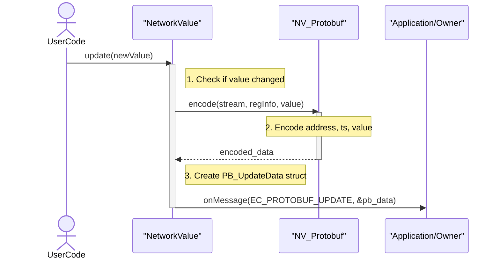
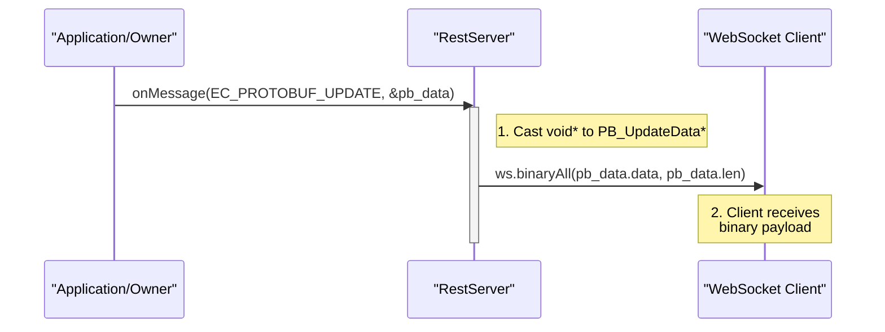

# NetworkValue Protobuf Serialization

## 1. Motivation

The current implementation of `NetworkValue` uses JSON for serializing data updates, which are broadcast over WebSockets by `RestServer`. While JSON is human-readable and easy to debug, it can be verbose and relatively slow to parse, especially on resource-constrained microcontrollers.

For high-frequency updates, a more efficient serialization format is needed. Protocol Buffers (Protobuf) offer a binary format that is:

-   **Smaller**: Payloads are significantly more compact than their JSON counterparts.
-   **Faster**: Parsing binary data requires less CPU effort than parsing text.
-   **Strongly Typed**: The schema, even if not defined in a `.proto` file, provides a clear structure.

The goal is to add Protobuf as an optional serialization mechanism for `NetworkValue` updates to improve performance for real-time client communication.

## 2. High-Level Design

We will introduce a new, optional feature to the `NetworkValue` class, similar to the existing `NV_Logging`, `NV_Modbus`, and `NV_Notify` features.

-   **New Feature Class**: A new class, `NV_Protobuf`, will be created in a separate header, `NetworkValuePB.h`. This class will contain the logic for encoding a `NetworkValue`'s state into the Protobuf binary format.

-   **Compile-Time & Runtime Activation**: The feature will be enabled by a compile-time flag (`NETWORKVALUE_ENABLE_PROTOBUF`) and can be managed at runtime via the `NetworkValue`'s feature flags, just like other features.

-   **Schema-less Approach**: To avoid the complexity of managing `.proto` files and a pre-compilation step, we will not use `.proto` definitions. Instead, we will perform direct encoding and decoding using the `nanopb` library's helper functions (`pb_encode_*`). The message structure will be consistently defined and implemented in the firmware and client-side code.

-   **Integration**: The `NetworkValue::update()` method will be modified. When a value changes, and the Protobuf feature is enabled, it will encode the update into a binary payload and send it to its owner (typically an application component) via the `onMessage` system.

-   **Broadcasting**: The `RestServer` will be updated to handle these new binary messages. Upon receiving a Protobuf-encoded update, it will broadcast the raw binary payload to all connected WebSocket clients, which will be responsible for decoding it.

## 3. Protobuf Message Structure

We will define a standard message structure for a single `NetworkValue` update. The client-side decoder must be built to expect this exact structure.

| Field Name | Field Number | Type | Description |
| :--- | :--- | :--- | :--- |
| `address` | 1 | `uint32` | The Modbus address, used as the unique identifier for the `NetworkValue`. |
| `timestamp` | 2 | `uint64` | The timestamp (`millis()`) when the update was generated. |
| **oneof value** | | | The actual value of the update. Only one of these will be present. |
| `sint_value` | 3 | `sint64` | For all integer types (`int`, `uint`, `short`, enums). Zig-zag encoded. |
| `bool_value` | 4 | `bool` | For boolean values. |
| `float_value` | 5 | `float` | For 32-bit floating-point values. |
| `bytes_value`| 6 | `bytes` | For `std::array` or other raw byte data. |

## 4. Implementation Details

### `NetworkValuePB.h`

This new file will contain the `NV_Protobuf` class with a series of overloaded/templated `encode` methods to handle the different data types supported by `NetworkValue<T>`. It will use `nanopb`'s `pb_encode.h` functions directly.

```cpp
// Example of an encode function in NV_Protobuf
template<typename T>
bool encode(pb_ostream_t* stream, const MB_Registers& regInfo, const T& value) const {
    // 1. Encode address
    pb_encode_tag(stream, PB_WT_VARINT, 1);
    pb_encode_varint(stream, regInfo.startAddress);

    // 2. Encode timestamp
    pb_encode_tag(stream, PB_WT_VARINT, 2);
    pb_encode_varint(stream, millis());

    // 3. Encode the specific value based on its type
    encode_value(stream, value);

    return true;
}
```

### `NetworkValue.h` Modifications

-   Add `NETWORKVALUE_ENABLE_PROTOBUF` and `E_NetworkValueFeatureFlags::E_NVFF_PROTOBUF`.
-   Include `NetworkValuePB.h` and inherit from `maybe<..., NV_Protobuf>`.
-   In `update_impl()`, add logic to check if the Protobuf feature is enabled. If so, it will:
    1.  Create a `pb_ostream_t` from a temporary buffer.
    2.  Call the `NV_Protobuf::encode()` method.
    3.  Create a new `PB_UpdateData` struct containing the encoded data and its length.
    4.  Send this struct via `owner->onMessage()` using a new verb, `E_CALLS::EC_PROTOBUF_UPDATE`.

### `enums.h` and `ModbusTypes.h`

-   `E_CALLS` enum in `enums.h` will be extended with `EC_PROTOBUF_UPDATE`.
-   A new struct `PB_UpdateData { uint8_t* data; size_t len; }` will be defined in `ModbusTypes.h` to carry the binary payload through the `onMessage` system.

### `RestServer.cpp` Modifications

-   The `onMessage` handler in `RestServer` will be updated to handle the `EC_PROTOBUF_UPDATE` verb.
-   When a message with this verb is received, it will cast the `void* user` data to `PB_UpdateData*`.
-   It will then call `ws.binaryAll(pb_msg->data, pb_msg->len)` to broadcast the binary payload to all connected WebSocket clients.

This approach provides an efficient, decoupled, and optional mechanism for pushing high-performance updates to clients without the overhead of JSON.

## 5. Sequence Diagrams

### Value Update and Encoding Sequence

This diagram shows how a `NetworkValue` change triggers the Protobuf encoding process and dispatches the message.



### Broadcast Sequence

This diagram illustrates how the `RestServer` receives the encoded message and broadcasts it to WebSocket clients.

