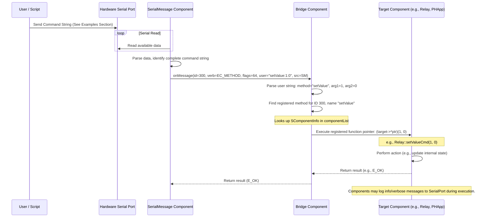

# Serial Communication Interface

This document describes the serial communication protocol used for interacting with the firmware, primarily for testing, debugging, and basic control.

## Overview

The system listens for specific command strings sent over the primary serial port (the one used for programming and monitoring).

- **Receiver:** The `SerialMessage` component is responsible for reading data from the serial port.
- **Parser:** `SerialMessage` parses incoming data looking for the specific command format.
- **Dispatcher:** Upon receiving a valid command, `SerialMessage` passes it to the `Bridge` component.
- **Executor:** The `Bridge` looks up the target component and method based on the command's `component_id` and `payload`, then executes the corresponding registered function on the target component instance.
- **Output:** Feedback and results are primarily sent back via log messages (`Log.info`, `Log.verbose`, etc.) printed to the same serial port.

## Command Format

Commands must adhere to the following string format:

`<<component_id;call_type;flags;payload:arg1:arg2...>>`

**Components:**

*   `<< >>`: Start and end delimiters for the command string.
*   `;`: Primary delimiter separating the main parts of the command header.
*   `:`: Secondary delimiter separating the payload (method name) from its arguments.

**Fields:**

1.  **`component_id` (short):** The unique ID of the target component. These IDs are defined in the `COMPONENT_KEY` enum in `src/enums.h`. For example, `1` usually refers to the main `PHApp`.
2.  **`call_type` (int):** Specifies the type of call. For calling registered component methods via the Bridge, this should generally be `2` (representing `E_CALLS::EC_METHOD`).
3.  **`flags` (int):** Message flags, often used internally. For simple commands, `64` is a commonly used value seen in examples, but its specific meaning isn't critical for basic method calls.
4.  **`payload` (String):** Contains the name of the method to call on the target component.
5.  **`arg1`, `arg2`, ... (short):** Arguments passed to the target method. Currently, the `Bridge` implementation parses up to two `short` arguments (`arg1`, `arg2`). The called method must match the signature `short functionName(short arg1, short arg2)`. Unused arguments in the command string should still be present (e.g., `:0:0`).

## Execution Flow



## Available Commands (Examples)

This list is based on methods registered in `PHApp::onRegisterMethods` and `Relay::onRegisterMethods`. Other components might register their own methods.

**PHApp (Component ID: 1)**

*   **List Components & Methods:** Lists components registered with the `Bridge`.
    ```
    <<1;2;64;list:0:0>>
    ```
*   **Print Component Info:** Calls `info()` on all components in `PHApp`'s list.
    ```
    <<1;2;64;print:0:0>>
    ```
*   **Reset Device:** Triggers `ESP.restart()`.
    ```
    <<1;2;64;reset:0:0>>
    ```
*   **Print Modbus Registers (Debug):** Prints the (now simplified) Modbus register table.
    ```
    <<1;2;64;printRegisters:0:0>>
    ```
*   **Test Relays:** Toggles Relay 0 and Relay 1 (using internal `setValue`).
    ```
    <<1;2;64;testRelays:0:0>>
    ```
*   **Get Battle Counter:** Returns the current value of the Modbus battle counter.
    ```
    <<1;2;64;getCounter:0:0>>
    ```
*   **Increment Battle Counter:** Increments the Modbus battle counter.
    ```
    <<1;2;64;incrementCounter:0:0>>
    ```
*   **Reset Battle Counter:** Resets the Modbus battle counter to 0.
    ```
    <<1;2;64;resetCounter:0:0>>
    ```
*   **Get Client Stats:** Returns Modbus client connection statistics.
    ```
    <<1;2;64;getClientStats:0:0>>
    ```
*   **Reset Client Stats:** Resets Modbus client connection statistics.
    ```
    <<1;2;64;resetClientStats:0:0>>
    ```

**Relay (Component IDs: 300, 301, ...)**

*   **Set Relay State:** Sets the relay ON (1) or OFF (0).
    *   Set Relay 300 ON: `<<300;2;64;setValue:1:0>>`
    *   Set Relay 300 OFF: `<<300;2;64;setValue:0:0>>`
    *   Set Relay 301 ON: `<<301;2;64;setValue:1:0>>`
*   **Get Relay Info:** Prints info about the relay (pin, address, current value) to serial log.
    *   Info for Relay 300: `<<300;2;64;info:0:0>>`
    *   Info for Relay 301: `<<301;2;64;info:0:0>>`

**Note:** The specific component IDs (like 300, 301) are defined in `src/enums.h` (`COMPONENT_KEY_MB_RELAY_0`, `COMPONENT_KEY_MB_RELAY_1`).

## Sending Commands

You can send these command strings using:

1.  **`npm run send`:** This uses the `scripts/send_message.py` script, which likely requires the full command string as an argument.
    ```bash
    npm run send -- "<<1;2;64;list:0:0>>"
    npm run send -- "<<300;2;64;setValue:1:0>>"
    ```
2.  **Manual Serial Monitor:** You can paste the command string directly into a serial monitor connected to the ESP32 (ensure your monitor doesn't add extra line endings unless `SerialMessage` handles them).
3.  **Other Scripts:** Scripts like `send_serial_cmd.py` are also available.

## Receiving Output

Most commands provide feedback by logging messages to the serial port using the `ArduinoLog` library. Monitor the serial output (`npm run monitor`) to see results, confirmations, and error messages. 