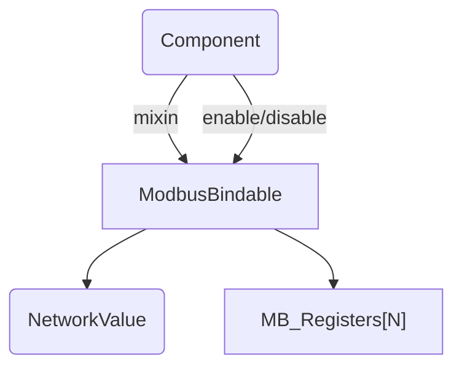

## Network-enabled Components – Incremental Design Notes

The objective is to remove repetitive boiler-plate around Modbus exposure while staying 100 % compatible with the existing `NetworkValue` feature set and the current component hierarchy.

### 1. Helper mix-in: `ModbusBindable<N>`
* Template parameter **`N`** = compile-time count of Modbus fields a component wants to expose.
* Derives from `Component` (exactly like `ModbusDevice<N>` today) and pre-allocates the `MB_Registers` array plus view.
* Adds two convenience wrappers:
  1. `registerField(id, name, fnCode, access)` – returns reference to the freshly allocated `MB_Registers` entry so the caller can immediately call `.bind(myNetworkValue)`.
  2. `bind(NetworkValue<T>& nv)` – copies the addressing information and keeps a pointer so that later **`enable()`** / **`disable()`** can toggle `NetworkValueFeatureFlags::MODBUS` for the field in one place.

This reduces a typical component constructor to a short chain:
```cpp
using NVf = NetworkValue<int>;
_modbus.registerField(Temperature, "Temp", FN_READ_HOLD_REGISTER, MB_ACCESS_READ_ONLY)
       .bind(_temperatureNV);
```
No manual index math, no local `_modbusBlocks[i] = …`.

### 2. Runtime toggle
Expose two helpers:
```cpp
void Component::enableNet()   { SBI(nFlags, OBJECT_NET_CAPS::E_NCAPS_MODBUS); }
void Component::disableNet()  { CBI(nFlags, OBJECT_NET_CAPS::E_NCAPS_MODBUS); }
```
`ModbusBindable` observes the flag in its `loop()` and calls `.enableFeature(MODBUS)` or `.disableFeature(MODBUS)` on every bound `NetworkValue` once when the state flips.

### 3. Stable logical identifiers
Today the only handle for a field is its **offset / absolute address** and a free-form name. To decouple user-code from register maps introduce:

1. A small `enum class` per component describing its logical fields – e.g. `enum class OmronField : uint8_t { PV, SP, StatusLow, … }`.
2. Each `MB_Registers` gains a new member `uint8_t logicalId` holding the cast value of that enum.
3. Helpers `byId(OmronField f)` and `mb_tcp_write(logicalId, value)` eliminate hard-coded offsets in the business logic.

Address computation stays automatic inside the `registerField()` helper which receives the enum value and returns the concrete startAddress.

### 4. Optional syntactic sugar – field builder
A single-line macro speeds up definition:
```cpp
#define NV_FIELD(enumId, nvRef, fn, acc) \
    registerField(enumId, #enumId, fn, acc).bind(nvRef)
```
Example:
```cpp
NV_FIELD(OmronField::PV,   _pv,  FN_READ_HOLD_REGISTER, MB_ACCESS_READ_ONLY);
NV_FIELD(OmronField::SP,   _sp,  FN_WRITE_HOLD_REGISTER, MB_ACCESS_READ_WRITE);
```

### 5. Migration path
1. Keep `ModbusDevice<N>` working untouched.
2. Introduce `ModbusBindable<N>` side-by-side – early adopters can switch gradually.
3. After all components migrate, retire the older mix-in.

### 6. Minimal runtime footprint
All helpers are `constexpr` / `inline`; no dynamic allocation, no RTTI, no `std` containers – fits ESP32 & PlatformIO constraints.

### 7. Quick architecture overview



---
**Next step**: draft the actual `ModbusBindable` header and refactor one small component (`NetworkValueTest`) as proof-of-concept. 