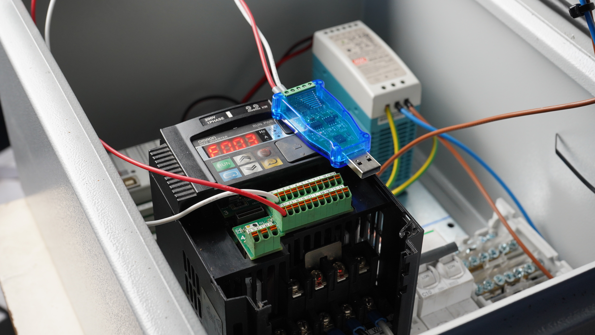
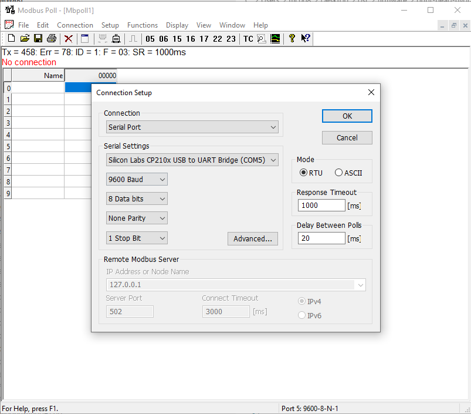
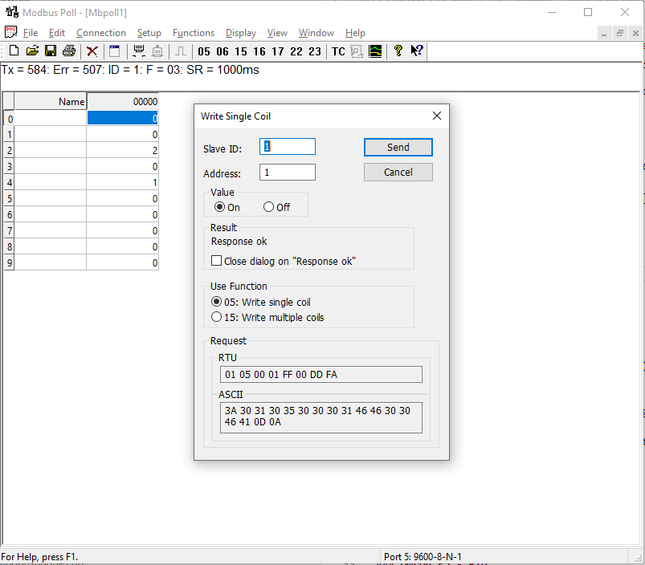
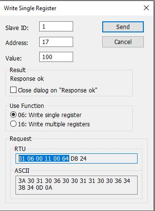
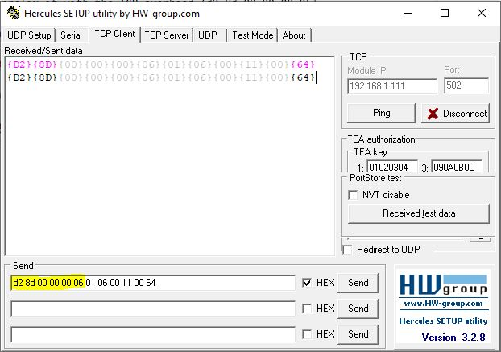

### Omron MX2

1. Please refer to the [OmronMX2 - Modbus setup guide](../vendor/omron/P641-E1-01_EGuide_CJ_Mod485_OMRON_3G3MX2-V1.pdf)(Section 7.2.2)

In case the terminal labels mismatch the documenation, please use `SN` for (A-) and `SP` for (B+)

1.1 Set basic parameters

- Max. Frequency, depending on gearbox, A004 = 75Hz
- Acceleration time, F02 = 2secs
- Decceleration time, F03 = 2secs

2. The firmware expects the VFD at **Slave-Address 1** !

Additionally, please check the [user manual](../vendor/omron/I570-E2-02B.pdf)

2.1 Modbus settings - Page 297

- Parity : None - `C74` = 00
- Speed : 9600 - `C71` = 5
- Slave Id : 1 - `C72` = 1

2.2 Control settings

- Frequency selection - `A001` : 03 (Modbus)
- Command selection - `A002` : 03 (Modbus)

**Please restart the inverter after changing those settings!**

2.3 Test settings, using serial Modbus adapter CP2102 and Modbus poll (see ./tools/MbPoll_v9.4.0_cracked.exe)

2.3.1 Wire the CP2102 USB adapter




2.3.2 Connect



2.3.3 Function - Write Coil



The 'Run' LED shoud now be on.


### Omron E5 - PID

### TCP interface

To set the target temperature to 100 Degc on PID1, the complete message for Modbus TCP would be



``` 01 06 00 11 00 64 D8 24 ```

- ```01```        : slave id
- ```06```        : Modbus verb / function code, in this case **WRITE HOLDING REGISTER**
- ```11```        : address (17)
- ```00 64```     : value (100), 2 bytes
- ```D8 24```     : CRC, 2 bytes. Since it's TCP, **this isn't evaluated and can be ignored** on the Controllino - PlasticHub firmware (see ['./firmware/Mudbus.cpp'](./firmware/Mudbus.cpp)).

In order to fake a Modbus message, all we need is ``` 01 06 00 11 00 64``` but we also have to prefix it with the TCP overhead (d2 8d 00 00 00 06)

|-- TCP Overhead----- | -------- Modbus ---- |

**```d2 8d 00 00 00 06 ```** |  ```01 06 00 11 00 64```

In example, we can send this via Hercules  :



The TCP overhead (```d2 8d 00 00 00 06```) is created as follow:

- ```d2 8d```        : Transaction identifier, 2 bytes
- ```00 00```        : Protocol identifier, 2 bytes
- ```00 06```        : Length of the message, 2 bytes
