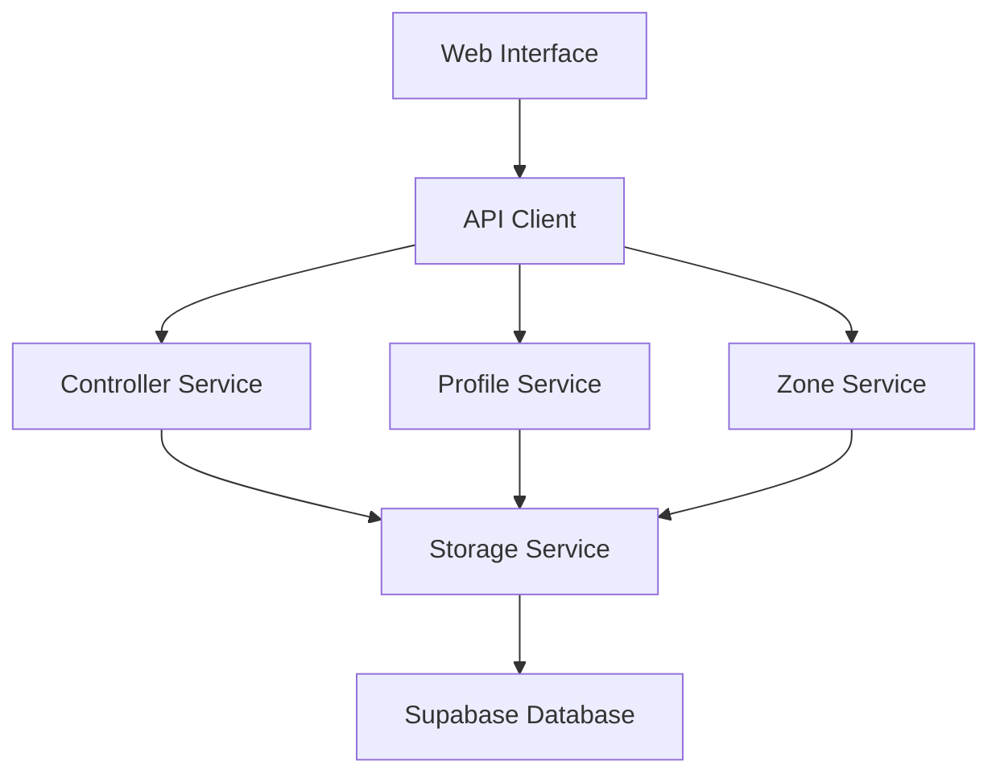
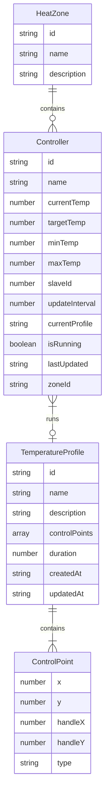
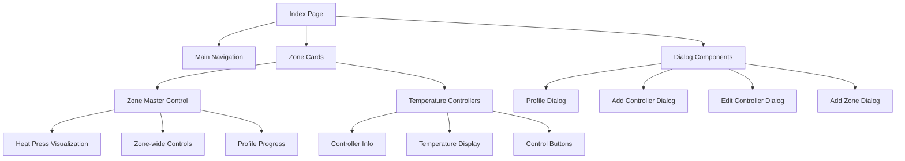
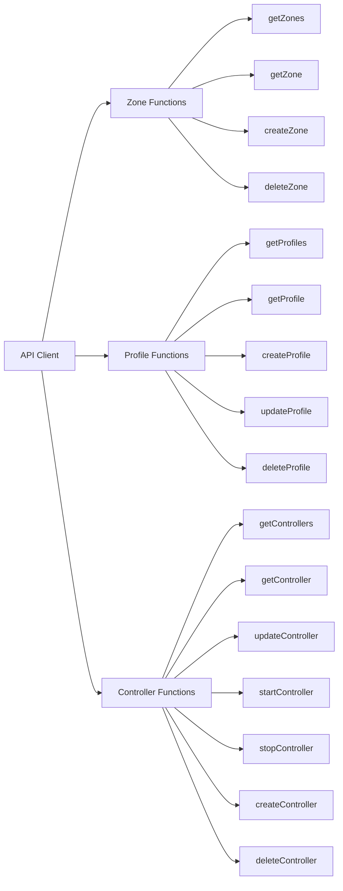
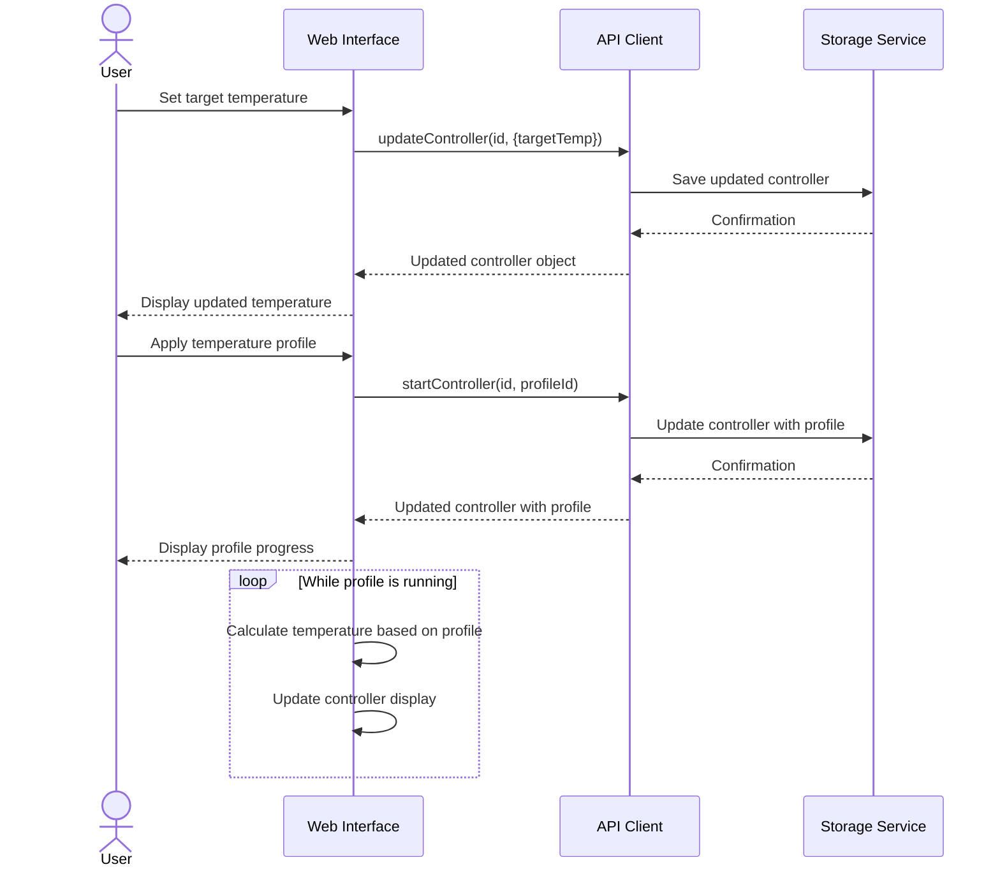
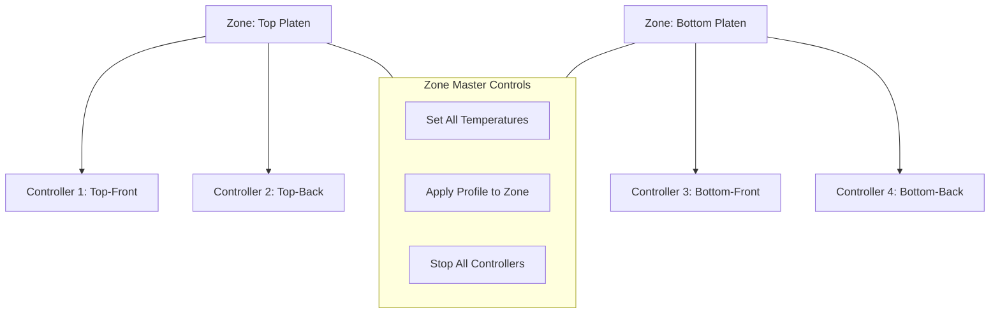
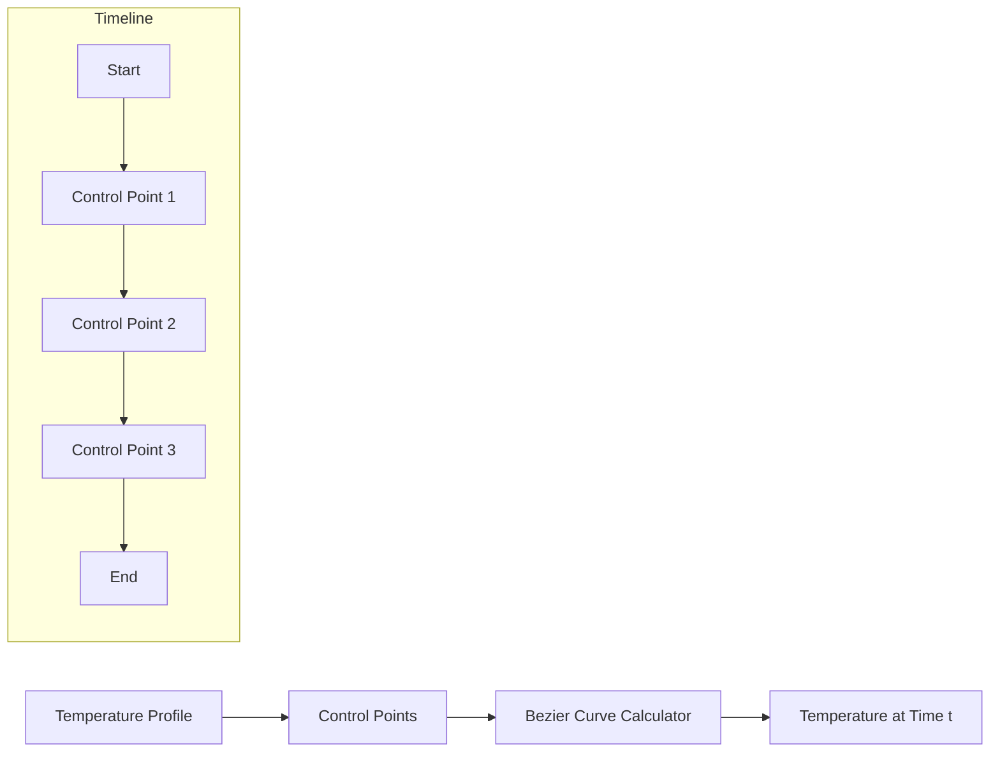
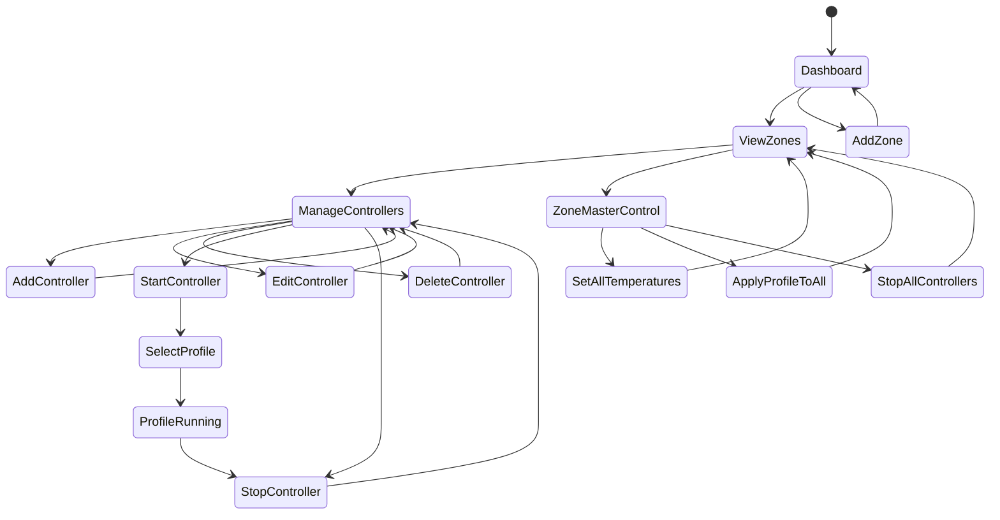

# Cassandra RC2 Temperature Control System

The Cassandra RC2 is a temperature control system designed for precise thermal management across multiple heat zones. This web interface allows operators to monitor and control various heating elements arranged in zones with support for temperature profiles.

## System Architecture

The following diagram shows the high-level architecture of the Cassandra RC2 system:



## Data Model

The core data entities in the system are:



## Component Hierarchy

The React component hierarchy for the main interface:



## API Structure

The API client provides these main function groups:



## Temperature Control Flow

The temperature control system functions as follows:



## Zone Management

Heat zones organize controllers into logical groups:



## Temperature Profiles

Temperature profiles define heating patterns over time:



## User Interface Workflow



## Getting Started

To run the Cassandra RC2 web interface:

1. Install dependencies:
   ```
   npm install
   ```

2. Start the development server:
   ```
   npm run dev
   ```

3. Access the web interface at http://localhost:5173

## Technologies Used

- React with TypeScript
- TanStack Query for data fetching and caching
- Shadcn UI components
- Supabase for data storage
- Bezier curve calculations for temperature profiles 