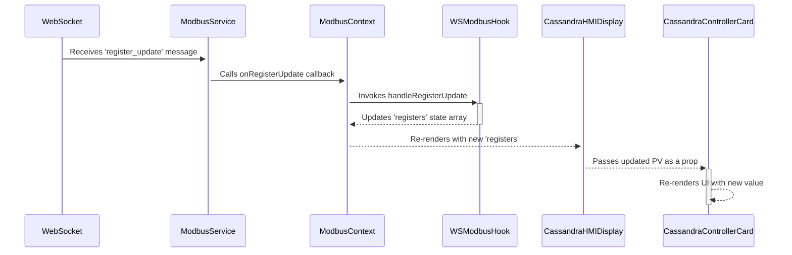

# From WebSocket to UI: Tracing `register_update`

This document outlines the journey of a single piece of data—a Modbus register update—from its arrival via a WebSocket message to its final rendering in the `CassandraControllerCard` React component. This flow demonstrates how real-time data is handled and propagated through the application's client-side stack.

## The Data Flow at a Glance



## Step 1: WebSocket Message Reception (`modbusService.ts`)

The process begins in `client/src/services/modbusService.ts`, which manages the raw WebSocket connection. The `handleMessage` method listens for incoming messages.

When a message with `type: 'register_update'` arrives, the service parses it and invokes a callback function, passing the update payload.

```typescript
// client/src/services/modbusService.ts

private handleMessage(data: any): void {
  try {
    const response = JSON.parse(data);
    // ... other message types
    else if (response.type === 'register_update' && response.data) {
       if (typeof response.data.address === 'number' && typeof response.data.fc === 'number') {
          // ... logic to validate update
          this.onRegisterUpdate(response.data as RegisterUpdatePayload);
       }
    }
    // ...
  }
}
```

## Step 2: Connecting the Service to React (`ModbusContext.tsx` & `useWSSocket`)

The `ModbusContext` is the bridge between the WebSocket service and the React component tree. It uses the `useWSSocket` custom hook to manage the connection. When connecting, it provides the `modbusService` with callback functions to execute when specific messages arrive.

Here, `wsModbus.handleRegisterUpdate` (from the `useWSModbus` hook) is passed as the `onRegisterUpdate` callback.

```tsx
// modbus-ui/src/contexts/ModbusContext.tsx

// ...
  const wsModbus = useWSModbus(
    setCoils,
    setRegisters,
    // ... other params
  );
  
  const wsSocket = useWSSocket(
    // ... other params
    wsModbus, // This contains handleRegisterUpdate
    // ...
  );
// ...
```

## Step 3: State Update with the `useRef` Pattern (`WS_Modbus.ts`)

`modbus-ui/src/contexts/WS_Modbus.ts` contains the core logic for handling Modbus-specific state. It employs a common React pattern using `useRef` and `useCallback` to prevent stale state within the WebSocket event handler.

1.  A stable `handleRegisterUpdate` function is created with `useCallback` and passed to the WebSocket layer. This function's reference never changes.
2.  This stable function calls whatever function is currently stored in `handleRegisterUpdateCallback.current`.
3.  A `useEffect` hook ensures that the function in `.current` is always up-to-date, with access to the latest `registers` state. It finds the register by its address in the `prevRegisters` array and updates its value.

```typescript
// modbus-ui/src/contexts/WS_Modbus.ts

export function useWSModbus(
  // ...
  setRegisters: React.Dispatch<React.SetStateAction<RegisterData[]>>,
  registers: RegisterData[],
  // ...
) {
  const handleRegisterUpdateCallback = useRef<(update: RegisterUpdatePayload) => void>();

  // This effect keeps the callback logic fresh
  useEffect(() => {
    handleRegisterUpdateCallback.current = (update: RegisterUpdatePayload) => {
      setRegisters(prevRegisters => {
        const index = prevRegisters.findIndex(reg => reg.address === update.address);
        if (index !== -1) {
          const newRegisters = [...prevRegisters];
          newRegisters[index] = { ...newRegisters[index], value: update.value };
          return newRegisters;
        }
        return prevRegisters;
      });
    };
  }, [registers, setRegisters]);

  // This is the stable function passed to the WebSocket handler
  const handleRegisterUpdate = useCallback((update: RegisterUpdatePayload) => {
    if (handleRegisterUpdateCallback.current) {
      handleRegisterUpdateCallback.current(update);
    }
  }, []);

  return {
    // ...
    handleRegisterUpdate,
  };
}
```

## Step 4: Propagating State with Context (`ModbusContext.tsx`)

When `setRegisters` is called, the `registers` state inside `ModbusProvider` updates. React detects this change and re-renders all components that consume this context.

```tsx
// modbus-ui/src/contexts/ModbusContext.tsx

export const ModbusProvider: React.FC<{ children: React.ReactNode }> = ({ children }) => {
  const [registers, setRegisters] = useState<RegisterData[]>([]);
  // ... other state and hooks

  return (
    <ModbusContext.Provider
      value={{
        // ...
        registers,
        // ...
      }}
    >
      {children}
    </ModbusContext.Provider>
  );
};
```

## Step 5: Consuming Data in the UI (`CassandraHMIDisplay.tsx`)

The `CassandraHMIDisplay` component is a high-level view that orchestrates many smaller components. It uses the `useModbus` hook to access the global `registers` array.

```tsx
// modbus-ui/src/components/CassandraHMIDisplay.tsx

const CassandraHMIDisplay = () => {
  const { 
    registers: allModbusRegisters, 
    // ...
  } = useModbus(); 
  // ...
```

Inside a `useMemo` hook, `processedData` is calculated. This memoized function re-runs whenever `allModbusRegisters` changes. It iterates through the registers to find the correct Process Value (PV) for each controller card it needs to display.

```tsx
// modbus-ui/src/components/CassandraHMIDisplay.tsx

const processedData = useMemo((): PartitionDisplayData[] => {
  // ... logic to map through partitions and controllers
  const controllersData: ControllerDisplayData[] = controllerConfigs.map(config => {
    const pvRegister = allModbusRegisters.find((reg: RegisterData) => 
      getSlaveIdFromGroup(reg.group) === config.slaveid && reg.name.endsWith(PV_REGISTER_NAME_SUFFIX)
    );
    // ...
    return {
      slaveid: config.slaveid,
      name: config.name,
      pv: pvRegister ? pvRegister.value : "N/A", // <-- The value is extracted here
      // ... more properties
    };
  });
  // ...
}, [allModbusRegisters, liveUiProfiles, settings]);
```

Finally, it renders a `CassandraControllerCard` for each controller, passing the extracted `pv` value as a prop.

```tsx
// modbus-ui/src/components/CassandraHMIDisplay.tsx

<CassandraControllerCard 
  slaveId={controller.slaveid} 
  name={controller.name} 
  pv={controller.pv} // <-- The updated value is passed down
  // ... other props
/>
```

## Step 6: The Final UI Update (`CassandraControllerCard.tsx`)

The `CassandraControllerCard` is a "dumb" component that simply receives props. When its parent (`CassandraHMIDisplay`) re-renders and passes a new `pv` prop, the card re-renders as well, displaying the latest value to the user.

```tsx
// modbus-ui/src/components/CassandraControllerCard.tsx

const CassandraControllerCard: React.FC<CassandraControllerCardProps> = ({ 
  slaveId, 
  name, 
  pv, // <-- Receives the new value
  // ...
}) => {
  // ...
  return (
    // ... JSX
    <div className={`text-sm col-span-1 font-mono justify-self-start self-center ${isPvError ? 'text-red-500 font-bold' : ''}`}>
      {isPvError ? <T>T/C Err</T> : (pv === 'N/A' ? <T>N/A</T> : (typeof pv === 'number' ? pv.toFixed(1) : pv))}
    </div>
    // ...
  )
}
```

This completes the journey from a raw data packet to a pixel on the screen, showcasing a robust and efficient pattern for handling real-time data in a React application. 